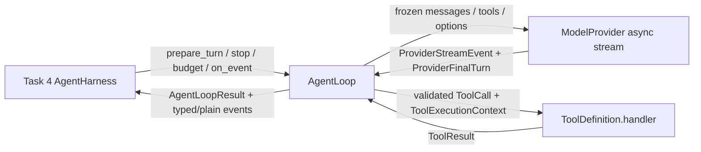

# Phase 1 Task 3 实施报告

## 结论

已实现无领域状态 `AgentLoop` 与 `ModelProvider` 基础协议。循环只依赖 provider
协议、Task 1 工具运行时类型和 JSON 冻结工具，不持有或导入 store、session、
route、orchestration。

## 接口图



### Provider 协议

- `ModelMessage`：支持 system/developer/user/assistant/tool，内容、metadata、工具调用均可投影为严格 JSON。
- `ProviderToolCall`：保留 provider 原始 JSON arguments；循环在执行前要求 object 并按工具 schema 校验。
- `ProviderStreamEvent`：支持 `text_delta`、`reasoning_delta`、`tool_call`、`final`。
- `ProviderFinalTurn`：提供权威文本、工具调用、finish reason、usage 和 metadata；`None` 表示 final 未提供字段，显式 `""`/`()` 覆盖 stream delta。
- `ModelProvider.stream(...) -> AsyncIterator[ProviderStreamEvent]`：循环直接 `async for` 消费，并拒绝 coroutine/list 等伪流。

### Loop 协议

- `TurnSnapshotInput`：逐轮冻结 provider 可见的 messages、tools、options；`prepare_turn` 可为下一轮返回替换快照。
- `AgentLoopConfig`：包含 identity、max turns、options、permissions、prepare/stop/budget/event callback。
- `AgentLoopResult`：包含明确 status、不可变 messages、turn count、不可变 turn snapshots、主 error 和不可变 secondary errors。
- 状态：`completed`、`max_turns`、`stopped`、`budget_exhausted`、`failed`；取消通过 `CancelledError` 传播，同时发送 `cancelled` failure event。

## 循环与事件序列

正常工具轮：

```text
freeze/prepare snapshot
-> stop/budget check
-> turn_started(snapshot_input)
-> provider async stream
-> append assistant
-> assistant_message(message)
-> execute sibling tools concurrently
-> append results in original call order
-> tool_result(tool_call, typed ToolResult, tool message) x N
-> turn_end
```

无工具终止：

```text
turn_started -> assistant_message -> turn_end(completed) -> loop_completed
```

provider/协议失败：

```text
turn_started -> loop_failed(failed)
```

外部取消：

```text
... -> loop_failed(cancelled) -> propagate asyncio.CancelledError
```

事件对象同时携带冻结 typed values，供 Harness 直接处理 proposals；`to_plain()` 保留持久化投影。

事件失败策略：

- `turn_started`、`assistant_message`、`tool_result`、`turn_end` callback 失败是主失败，loop 返回 `failed`。
- `loop_completed` callback 失败会把本次运行转为 `failed`，并尝试发送 `loop_failed`。
- 已有 provider/tool error 或 `CancelledError` 时，`loop_failed` callback 失败只记录为 `secondary_errors` 或 exception note，不替换主原因。
- 取消始终向外传播 `CancelledError`。

## 工具执行与错误

- 同一 assistant 的合法 handler 通过显式 `asyncio.Task` + `gather` 并发执行。
- 任一工具自取消或 loop 外部取消时，立即 cancel 所有未完成 sibling，并 `gather(return_exceptions=True)` 完整 drain 后传播原 `CancelledError`。
- 结果和 `tool_result` 事件严格按 provider 调用顺序追加，不按完成顺序追加。
- 单 handler 的普通异常转为 `ToolResult(is_error=True, error_code="handler_error")`，不取消兄弟调用。
- `call_id` 在整个 run 唯一；传入历史 assistant/tool IDs、前序 turns 和当前 batch 均预占，重复调用不执行 handler。
- 工具消息和事件包含 `turn_index`/`call_index`，违规重复 ID 仍可无歧义关联。
- 未知工具、重复 `call_id`、非 object arguments、schema 不匹配、错误返回类型和 call_id 不匹配均转为结构化 error result。
- handler 只接收 Task 1 `ToolCall`、`ToolExecutionContext`，并要求返回 Task 1 `ToolResult`。

## RED / GREEN

### RED 1：主协议缺失

命令：

```text
python3 -m pytest tests/equipment_deep_research/unit/test_agent_loop.py -q
```

结果：collection error，`ModuleNotFoundError: equipment_deep_research.harness.agent_loop`。

### RED 2：typed persistence handoff 缺失

命令：

```text
python3 -m pytest tests/equipment_deep_research/unit/test_agent_loop.py::test_event_order_matches_persistence_contract -q
```

结果：失败，`AgentLoopEvent` 缺少 `snapshot_input`。

### RED 3：provider 运行时类型不够严格

命令：

```text
python3 -m pytest tests/equipment_deep_research/unit/test_agent_loop.py::test_provider_contracts_are_strict_json_values_without_shared_containers -q
```

结果：失败，非字符串 `call_id` 和非 Mapping metadata/options 未被拒绝。

### GREEN

聚焦测试：

```text
23 passed in 0.09s
```

equipment 套件：

```text
138 passed in 0.40s
```

全仓测试：

```text
161 passed in 0.57s
```

仓库当前未安装 `pytest-asyncio`，因此测试使用仓库已有的 `asyncio.run` 风格执行 async case，没有增加依赖。

## 审查修复 RED / GREEN

### C1：取消未 drain sibling

RED：工具自取消后 sibling 的 cancellation cleanup 尚未完成，断言 `sibling_cancelled.is_set()` 失败。

GREEN：工具自取消和外部取消两项回归通过；原取消消息保持，所有 sibling 完成 cancellation cleanup，未发生完成副作用。

### I1：final 显式空未覆盖 delta

RED：final `text=""` 被 delta 文本替代；final `tool_calls=()` 仍执行 streamed call。

GREEN：两项显式空覆盖测试通过，只有 `None` 才回退 delta。

### I2：call_id 仅 batch 内唯一

RED：历史 assistant/tool IDs 和前序 turn ID 均再次执行 handler。

GREEN：历史、跨轮、同 batch 重复均返回 `duplicate_call_id`，handler 不执行；消息和事件记录 turn/call index。

### I3：终结事件 callback 覆盖主异常

RED：`loop_failed` callback 的 RuntimeError 替换 provider error 或 `CancelledError`；completion 与 failure callback 连续失败时第二个错误逃逸。

GREEN：provider 主错和原取消保持；secondary callback errors 进入 `secondary_errors` 或 exception notes；普通事件 callback 失败返回明确 `failed`。

## 依赖扫描

以下扫描无命中：

```text
rg -n "DomainStore|SqliteRunStore|SessionStore|ResearchRoute" src/equipment_deep_research/harness/agent_loop.py
rg -n "subprocess|os\.system|codex exec|RUN_CODEX" src/equipment_deep_research/providers src/equipment_deep_research/harness/agent_loop.py
```

`git diff --check` 和目标模块 `compileall` 通过。

## 提交

- 初始提交：`3f229766779b60c1113821d28b2dfdc9d45f65e7` (`feat: add domain-free agent loop protocol`)
- 审查修复原子提交主题：`fix: harden agent loop cancellation and identity`
- 修复范围：provider final-turn 三态、agent loop cancellation/identity/event policy、focused regressions、本报告。
- 本报告随同该原子提交提交；最终 commit hash 记录在任务最终回复中，避免自引用哈希改变提交本身。

## 自审

- 未修改所有权之外的生产/测试文件，未回退其他工作者提交。
- provider 每轮输入使用 tuple 和冻结 Mapping；结果、snapshots、事件 payload 不共享调用方可变容器。
- assistant message 在工具执行前追加；工具消息及事件严格按调用顺序追加。
- `CancelledError` 不被 handler error 归一化捕获；未完成 sibling 会被 cancel、drain，之后才传播原取消。
- final turn 对显式空字段权威，`None` 才表示使用 delta 聚合值。
- call ID 注册表覆盖历史、准备后的 snapshot、前序 turns 和当前 batch；重复调用不会进入 handler。
- 终结事件 callback 失败不覆盖已有 provider/tool/cancellation 主原因。
- provider stream 缺 final、final 后继续产出、yield 非协议事件均明确失败。
- Task 4 可用 `prepare_turn` 调整下一轮 provider 可见 tools/options/messages，用 typed event 直接保存消息、工具结果和 proposals。
- Phase 2 Responses provider 可直接把 SSE delta/final 投影到基础事件，不需要改变循环。

关注点：当前 schema 校验是无外部依赖的 JSON Schema 子集，覆盖 object/array/primitive/required/properties/additionalProperties/enum；未来如工具 schema 使用 oneOf、anyOf、pattern 等关键字，应在工具注册层升级校验器，而不是在 provider 中绕过。
