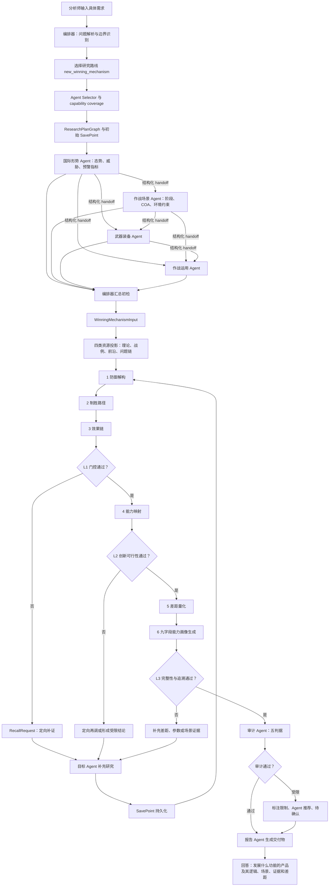

# 具体需求下的多智能体执行流程

> 更新说明：本文保留最初架构分析。实现差距完成修复后的任务驱动流程、模型自主 Agent 选择、并发波次和新案例，请以[《完善后的任务驱动多智能体执行流程》](./完善后的任务驱动多智能体执行流程.md)为准。

## 1. 文档目的

本文结合《编排器与动态智能体总体架构图》《制胜机理智能体详细架构图》和当前项目代码，说明一个具体研究需求进入系统后，各 Agent 如何分工、交接、门控、再调并形成最终“作战能力图像需求”。

本文选用一个防御性案例：

> 面向未来低空小型无人机与蜂群威胁，研究重要固定目标防护需要发展具备什么功能的装备，并说明这些功能来自什么制胜逻辑、适用于哪些场景、依据哪些公开证据、弥补什么能力缺口。

该案例适合采用 `new_winning_mechanism`（新制胜机理）路线。案例中的具体结论是流程演示性假设，不代替真实联网研究和专家确认。

## 2. 项目中真实存在的执行角色

| 角色 | 核心职责 | 主要输入 | 主要输出 |
| --- | --- | --- | --- |
| 分析师 | 提出主题、路线、边界、Agent 选择和确认节点 | 研究需求 | `ResearchProblem` |
| 编排器 | 解析问题、选择路线与 Agent、检查覆盖度、生成计划、组织交接、门控和再调 | `ResearchProblem`、Agent Registry、策略配置 | `ResearchPlanGraph`、任务信封、coverage、trace |
| 国际形势 Agent | 研究战略态势、威胁力量、对手动向和预警指标 | 独立任务、证据策略 | `BaselineFindingPacket` + `EvidenceCard[]` |
| 作战场景 Agent | 构造场景、阶段、敌方 COA、关键窗口和环境约束 | 任务 + 国际形势摘要 | `BaselineFindingPacket` + `EvidenceCard[]` |
| 武器装备 Agent | 研究现役/在研装备、参数区间、成熟度、接口和能力边界 | 任务 + 态势/场景摘要 | `BaselineFindingPacket` + `EvidenceCard[]` |
| 作战运用 Agent | 研究力量协同、备选 COA、保障约束、失败模式和经验迁移 | 任务 + 前三路摘要 | `BaselineFindingPacket` + `EvidenceCard[]` |
| 制胜机理 Agent | 汇总四路基线，调用四类资源，执行六步推理和 L1/L2/L3 | `WinningMechanismInput` | 阶段输出、再调请求、九字段能力画像 |
| 审计 Agent | 执行一致性、置信度、覆盖度、用户确认、轮次约束等检查 | 阶段输出、证据、trace、coverage | `AuditResult` |
| 报告 Agent | 生成研究报告和结构化交付物 | 能力画像、审计、证据索引 | `report.md` 等 |

每个基线 Agent 有独立 Harness、工具权限、预算、checkpoint 和 append-only session。Agent 之间不共享原始对话，只传递结构化发现、证据 ID、置信度、开放问题和 handoff 摘要。

## 3. 案例需求如何被编排器拆解

### 3.1 分析师输入

建议将自然语言需求结构化为：

```yaml
topic: 低空小型无人机与蜂群威胁下的重要固定目标防护装备能力需求
research_route: new_winning_mechanism
objective: 回答需要发展具备什么功能的产品
scope:
  target: 机场、能源设施、指挥与保障节点等重要固定目标
  time_horizon: 未来3至5年
  evidence_boundary: 公开且允许使用的信源
constraints:
  - 只形成防御性、任务级能力需求
  - 结论必须关联证据卡
  - 不确定参数使用区间或标记未知
selected_agents:
  - international_situation
  - combat_scenario
  - weapon_equipment
  - operational_employment
max_rounds: 5
```

### 3.2 问题解析器形成问题框架

编排器把需求拆成五个必须回答的问题：

1. 威胁为什么会成为重要目标防护的主要压力？
2. 威胁在什么场景、阶段、环境和约束下出现？
3. 现有探测、识别、指挥、处置与保障能力有什么边界？
4. 应通过什么防御性制胜逻辑降低威胁效果？
5. 最终需要发展哪些产品功能，哪些是新能力，哪些是现有装备升级？

### 3.3 路线与能力覆盖计算

`new_winning_mechanism` 路线要求至少覆盖：

- `situation`
- `threat`
- `scenario`
- `equipment`
- `operation`

默认四路 Agent 能覆盖这些必选标签，并补充 `strategy`、`coa`、`environment`、`capability_gap`、`technology_readiness`、`coordination` 和 `lessons`。

若分析师只启用部分 Agent，系统不得假装全覆盖。例如缺少武器装备 Agent 时，应输出 coverage limit，并在 L1 触发面向 `equipment` 的再调或生成 `AgentRecommendation`。

## 4. 当前项目的实际执行流程（文字版）

### 步骤 1：创建运行空间和初始保存点

编排器创建本次 run 的 workspace、SQLite 运行库、领域对象存储、trace 和各 Agent session。初始写入 `ResearchProblem`、运行配置指纹、任务状态和 `run_started` 事件。

作用是保证任务可恢复、可审计，并避免执行中配置变化污染当前轮次。

### 步骤 2：国际形势 Agent 独立研判

该 Agent 围绕以下检索轨道工作：战略政策与联盟、力量建设与部署演训、装备采购与工业基础、新兴技术与作战概念、危机事件与公开表态。

在本案例中，它应形成：

- 威胁发展趋势：低成本、小型化、数量化、自主化和多方向进入造成的防护压力；
- 对手能力建设与运用倾向；
- 近期、中期、远期威胁尺度；
- 早期预警指标和替代假设；
- 对重要目标防护的能力牵引。

其输出不是长篇聊天记录，而是一个 `BaselineFindingPacket`，包括 findings、claim/evidence 关联、confidence、coverage notes、open questions 和 handoff summary。

### 步骤 3：作战场景 Agent 接收态势摘要并构造场景

该 Agent 只接收国际形势 Agent 的结构化摘要，不接收其原始 session。它将宏观威胁转换为可推理场景，例如：

- 危机前：低空活动与通信特征增加，但目标意图不明确；
- 初始接触：少量目标用于侦察、诱导或测试防护响应；
- 体系对抗：多方向、多批次目标造成探测、识别和指挥资源拥塞；
- 持续阶段：防护系统面临弹药、能源、频谱和人员负荷约束；
- 战损重构：部分传感器或通信节点失效后需要维持最低防护闭环。

输出包括场景框架、至少两个场景分支、敌方可能/危险 COA、关键时间节点、复杂电磁与地物环境约束、能力压力点和待补证问题。

### 步骤 4：武器装备 Agent 接收态势与场景摘要并做能力对比

该 Agent 将场景压力映射到公开可研究的装备维度：

- 探测：雷达、光电、声学、射频等多源传感方式的覆盖边界；
- 识别：低慢小目标、鸟类和民用活动之间的分类与误报问题；
- 指挥：传感器、指挥系统和效应器接口；
- 处置：软硬手段的适用条件、资源消耗和附带风险；
- 保障：持续运行、快速部署、模块替换、能源与弹药补充；
- 技术成熟度：哪些功能可近期工程化，哪些仍需验证。

输出应保留参数区间、型号批次、来源日期、冲突数据和置信度，形成“现有能力—场景要求—残余差距”比较。

### 步骤 5：作战运用 Agent 综合前三路交接

该 Agent 不再只看单件装备，而是研究体系如何运行：

- 分层防护与重点方向动态调整；
- 传感器—指挥—效应器的信息流和接口；
- 基线方案、弹性分布方案、资源受限方案比较；
- 误警、饱和、链路中断、单点失效等失败模式；
- 连续值班、能源、弹药、维修和战损恢复约束；
- 战例经验能否迁移到本场景及其适用边界。

其结果把“装备参数”转换为“任务级功能需求”，例如持续态势融合、威胁排序、人机协同决策、效应器分配和降级运行。

### 步骤 6：编排器汇总初检并生成制胜机理输入包

编排器对四个 Packet 执行：

- 契约校验；
- 证据引用与材料化检查；
- claim—evidence 对齐；
- 时间、场景和参数一致性检查；
- 冲突、反证和开放问题汇总；
- capability coverage 检查。

之后通过 Context Projector 生成 `WinningMechanismInput`。其中只包含问题框架、Packet ID、证据索引、coverage map、冲突集、开放问题、当前轮次和轮次预算，不暴露其他 Agent 原始会话。

### 步骤 7：制胜机理 Agent 投影四类知识资源

系统针对本次 run 动态形成四类资源投影：

1. 理论工具库：防御分层、重心识别、效果链、效果—功能—性能映射、五档差距评估；
2. 战例库：从证据中筛选公开战例、经验和失败模式；
3. 前沿情报库：筛选自主、智能、无人、模块化和新型传感/处置技术材料；
4. 问题链：敌方关键依赖是什么、优选制胜路径是什么、效果链要求哪些能力、创新机制是否可行。

### 步骤 8：执行六步串联推理

#### 8.1 防御解构

按“感知—决策—处置—冗余/恢复”分层，识别防护体系的关键依赖和薄弱点。案例中可能得到：单一传感器易受地物遮蔽或电磁环境影响，人工研判难以应对多目标高频更新，单一处置手段难以兼顾成本与适用边界。

#### 8.2 制胜路径

形成并比较候选路径：

- 路径 A：提高单点探测或单发处置性能；
- 路径 B：构建多源协同、快速决策、分层处置和韧性保障闭环；
- 路径 C：通过分布式节点和机动补盲降低单点失效影响。

本案例的演示性优选路径是 B+C：不以单一装备“包打天下”，而以低成本持续感知、自动融合判别、资源优化分配、软硬分层处置和降级运行形成体系优势。

#### 8.3 效果链

```text
多源持续发现
  -> 降低漏警并形成稳定航迹
  -> 快速识别与威胁排序
  -> 选择适当处置方式并分配资源
  -> 降低饱和和误处置风险
  -> 维持重要目标任务连续性
```

每个节点都应关联证据、置信度、假设和风险，不能只保留口号式结论。

#### 8.4 能力映射

把效果链转换为“效果—功能—性能/约束”三级需求：

| 预期效果 | 产品功能 | 后续应量化的性能或约束 |
| --- | --- | --- |
| 持续发现低空小目标 | 雷达/光电/射频等多源接入与时空融合 | 覆盖范围、刷新率、弱小目标检测、复杂背景适应性 |
| 降低误报漏报 | 多模态分类、可信度评估和人工复核 | 识别率、误报率、置信度解释、训练数据适用边界 |
| 缩短处置链路 | 自动告警、威胁排序、方案推荐 | 决策时延、并发目标数、人机权限边界 |
| 避免资源快速耗尽 | 软硬手段编排和效应器分配 | 单目标成本、库存/能量状态、重复交战控制 |
| 节点受损后继续运行 | 分布式部署、自治协同、断链降级 | 接口标准、重构时间、最低可用能力、网络抗毁性 |
| 适应多类型任务 | 开放式接口和模块化载荷 | 接入周期、兼容协议、软件升级和验证机制 |

#### 8.5 差距量化

对每项能力按“空白、关键差距、部分差距、满足、超出”五档评价。评价必须来源于场景需求与现有装备比较，不能由模型凭空打分。

演示性示例：

- 多源接入可能已有基础，但跨厂商实时融合与统一航迹管理存在部分或关键差距；
- 面向高并发目标的自动威胁排序与资源优化可能存在关键差距；
- 单节点探测/处置能力可能满足局部场景，但在饱和、复杂电磁和持续运行场景下存在差距；
- 断链自治、快速重构和开放式效应器接入可能是需重点验证的新能力方向。

#### 8.6 能力画像生成

去重归并后，形成两类输出：

- 新作战能力方向：体系化、分布式、智能化的低空防护闭环；
- 现有装备升级需求：为现有探测、指挥或处置设备增加标准化接入、协同、抗干扰和降级运行功能。

### 步骤 9：L1/L2/L3 门控与定向再调

#### L1 制胜逻辑门控

检查证据完整性、平均置信度是否达到 70%、必需 capability 是否覆盖、场景/威胁/装备信息是否闭环。如果低于门槛，生成 `RecallRequest`。

案例：如果“复杂背景下误报率和多目标并发能力”证据不足，可定向再调武器装备 Agent：

```yaml
source_layer: L1
target_agent_id: weapon_equipment
reason: 现有公开证据无法支撑高并发目标下的识别与处置能力判断
required_data:
  - 公开试验或部署材料中的目标规模、识别效果和适用边界
  - 反证或失败案例
return_node: L1
urgency: high
```

补充结果写入 SavePoint 后从 L1 恢复，而不是重跑所有 Agent。

#### L2 概念创新门控

对新概念、新技术、新手段和跨域移植方向评估可行性。当前代码门槛为可行性不低于 3/5，且 L1 必须通过。

案例中可比较“全自动处置”“人机协同处置”“集中式融合”“边缘自治融合”等方向，筛除无法满足安全边界、成熟度或工程约束的方案。

#### L3 能力画像门控

检查九字段是否齐全、能力差距是否有数据支撑、场景—制胜逻辑—证据—能力是否双向可追溯。未满足时可对差距数据、参数或场景映射发起再调。

系统约束为总轮次最多 5 轮、同一目标最多再调 3 次。若当前启用 Agent 无法覆盖缺口，则生成 Agent 推荐并把结果标为受限结论。

### 步骤 10：五判据审计和报告交付

审计 Agent 检查：

1. 一致性：场景、逻辑、能力和装备映射不矛盾；
2. 置信度：关键结论达到 70%，不足则降级；
3. 覆盖度：路线关键维度有结论或明确限制；
4. 用户确认：正式发布保留分析师确认节点；
5. 轮次约束：总轮次不超过 5，同目标再调不超过 3。

报告 Agent 最终生成 `report.md`、`capability_images.json`、`round_summary.json`、`domain.jsonl`、`trace.jsonl`、各 Agent 独立 session 和证据 artifacts。

## 5. 项目执行流程图



## 6. 案例的演示性能力画像

以下两项用于说明最终数据形态，不代表已经完成真实证据论证。

### CAP-NEW-001 分布式智能低空防护闭环能力

| 字段 | 示例内容 |
| --- | --- |
| 能力编号 | CAP-NEW-001 |
| 名称 | 分布式智能低空防护闭环能力 |
| 装备类别 | 低空防护体系/指挥与任务系统 |
| 类型 | 新作战能力方向 |
| 来源制胜逻辑 | 以多源持续感知、快速可信判别、资源优化分配、分层处置和韧性重构对抗数量化、低成本和多方向威胁 |
| 关联场景 | 重要固定目标在复杂背景、强电磁约束和多批次目标压力下的持续防护 |
| 优先级 | 高：关键性高、紧迫性高、工程可行性中高 |
| 能力差距 | 多源跨系统融合、高并发威胁排序、效应器协同、断链自治和战损重构能力需重点补强 |
| 能力画像 | 具备异构传感器接入、统一航迹融合、多模态识别、威胁排序、人机协同决策、软硬效应器编排、资源状态管理、边缘自治、断链降级和开放接口能力 |

### CAP-UPGRADE-001 现有低空探测与处置装备协同升级能力

| 字段 | 示例内容 |
| --- | --- |
| 能力编号 | CAP-UPGRADE-001 |
| 名称 | 现有低空探测与处置装备协同升级能力 |
| 装备类别 | 现役雷达、光电、干扰/拦截设备及指挥节点 |
| 类型 | 现有装备升级需求 |
| 来源制胜逻辑 | 通过标准接口和软件定义协同把分散单机能力接入统一防护闭环，缩短发现到处置链路并提高资源利用率 |
| 关联场景 | 现有设备型号多、接口异构、节点可能失效且需要持续值班的目标防护场景 |
| 优先级 | 中高：紧迫性高、工程可行性高 |
| 能力差距 | 数据格式、时钟同步、统一航迹、任务编排、状态回传和降级运行能力不一致 |
| 能力画像 | 增加标准化数据适配、边缘融合、可信时间同步、统一任务接口、效应器状态回传、远程软件升级、抗干扰链路和故障隔离功能 |

## 7. 目标架构与当前实现的差异

### 7.1 基线层并发方式

架构图将四类基线 Agent 描述为可并发研判；当前 `DeepResearchRunner` 按 `AgentRegistry.execution_order(...)` 和 selected agent 顺序逐一运行，以保证国际形势到作战场景、武器装备、作战运用的结构化上游交接。

因此，当前更准确的描述是“动态选择 + 拓扑串行/局部可并发”，而不是四路完全同时启动。后续若要提高效率，可把每个 Agent 内部的独立检索轨道并发化，或把无依赖节点分波次并发，同时保留 handoff 屏障。

### 7.2 制胜机理的内容深度

当前六步推理和 L1/L2/L3 已具备可追溯对象、门控和再调框架，但部分阶段内容仍是路线模板化输出。真实项目应用需要由模型结合 Packet 和证据生成具体弱点、效果链、参数差距和创新评估，而不应仅复用固定短语。

### 7.3 再调机制

当前实现能从 L1 的 coverage 或低置信度触发再调，完成后清理活动阶段状态并重新运行制胜机理。详细架构图设想 L1、L2、L3 都可按不同原因精确回到 `return_node`；因此后续应进一步细化 L2 技术成熟度再调和 L3 参数/差距再调，而非主要依赖 L1 触发。

### 7.4 用户确认门控

运行入口已有 `analyst_confirmed` 参数，但当前审计函数内的 `user_confirmation` 固定为 `True`。若要严格符合架构图，应把真实确认状态传入审计，并在未确认时禁止正式发布，仅允许生成待审稿。

### 7.5 审计轮次

审计函数支持 `current_rounds`，但主流程调用时未传入真实 round index，默认按 1 轮检查。应改为使用 checkpoint 的实际轮次，才能严格验证总轮次约束。

## 8. 建议的工程化执行原则

1. 编排器只做任务与状态控制，不替代专业 Agent 形成领域判断。
2. Agent 间只传结构化 handoff，不共享原始长上下文。
3. 每个 claim 必须能回溯到 EvidenceCard 和材料化 artifact。
4. 所有补证都由门控缺口驱动，禁止无目标重复搜索。
5. 新能力与现有装备升级需求必须分开输出。
6. 最终能力画像必须形成“场景—威胁—制胜逻辑—效果链—功能—差距—证据”的闭环。
7. 未达到置信度、覆盖度或用户确认要求时，只交付受限结论，并明确下一步需要哪个 Agent 补充什么数据。

## 9. 一句话总结

针对一个具体需求，本项目不是让多个 Agent 各写一份报告后简单拼接，而是由编排器把需求转成 capability 驱动的研究计划，让专业 Agent 产生隔离且可审计的证据 Packet，再由制胜机理 Agent 通过四类资源、六步推理和 L1/L2/L3 门控把“事实发现”逐级转化为“需要发展什么功能的产品”，不足之处通过定向再调补齐，最后经五判据审计形成可追溯交付。
