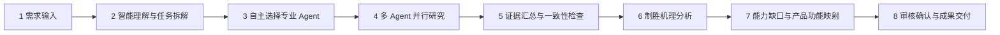

# 装备能力图像 Deep Research 多智能体研究执行流程

## 一、系统要解决的问题

分析师提出一个装备研究需求后，系统自动组织多个专业智能体开展公开资料研究，逐步回答：

> 需要发展什么功能的产品？这些功能来源于什么制胜逻辑，适用于什么场景，解决什么能力缺口，有哪些证据支撑？

## 二、总体执行流程



## 三、各阶段如何执行

| 阶段 | 系统执行内容 | 阶段成果 |
| --- | --- | --- |
| 1. 需求输入 | 分析师输入研究主题、范围、时间、约束和交付要求 | 结构化研究任务 |
| 2. 智能理解 | 自动识别研究路线，拆解关键问题和所需专业能力 | 研究问题清单、能力需求清单 |
| 3. Agent 选择 | 模型根据任务自主选择所需 Agent，不固定要求所有 Agent 参加 | Agent 组合与执行计划 |
| 4. 专业研究 | 各 Agent 在独立环境中检索、阅读和分析公开资料，可并行执行 | 专业发现、证据卡、待确认问题 |
| 5. 汇总初检 | 检查证据质量、结论冲突、研究覆盖度和信息缺口 | 制胜机理输入包 |
| 6. 制胜分析 | 按“防御解构—制胜路径—效果链—能力映射—差距量化—能力画像”开展推理 | 制胜逻辑、关键能力和创新方向 |
| 7. 定向补充 | 对证据不足或结论不确定的部分，定向召回相关 Agent 补充研究 | 补充证据和修订结论 |
| 8. 审核交付 | 检查一致性、置信度、覆盖度、研究轮次和分析师确认状态 | 报告、能力画像和完整审计记录 |

## 四、Agent 如何自主分工

系统不是固定调用全部 Agent，而是根据具体任务选择最合适的组合。

| 专业 Agent | 主要研究内容 | 典型适用任务 |
| --- | --- | --- |
| 国际形势 Agent | 国际安全态势、潜在威胁、战略格局和对手动向 | 未来威胁、新制胜机制和战略牵引研究 |
| 作战场景 Agent | 任务场景、对抗阶段、关键时间窗口和环境约束 | 场景构建、任务压力和作战条件研究 |
| 武器装备 Agent | 现役及在研装备、参数、成熟度、接口和能力边界 | 装备对比、技术评估和能力缺口研究 |
| 作战运用 Agent | 兵力协同、任务流程、作战方案、保障约束和经验教训 | 作战运用、体系协同和战例复盘研究 |

例如：

- 研究国际战略变化对未来装备的影响，需要国际形势 Agent；
- 研究既定场景下的现有装备缺口，可只选择作战场景、武器装备和作战运用 Agent；
- 研究局部战争案例，可重点选择作战场景、武器装备和作战运用 Agent。

## 五、具体案例

### 研究需求

> 评估现有机场低空防护系统应对多批次低慢小目标时的能力缺口，并提出未来三至五年需要升级或新发展的产品功能。

### 系统选择的 Agent

该任务已给定应用场景，不要求重新分析国际战略环境，因此系统选择：

```text
第一批并行研究：作战场景 Agent + 武器装备 Agent
第二批综合研究：作战运用 Agent
```

### 各 Agent 的工作

- 作战场景 Agent：分析多方向、多批次目标进入，复杂背景干扰、连续值班和节点失效等场景压力。
- 武器装备 Agent：梳理现有探测、识别、指挥、处置和保障能力，形成装备能力基线。
- 作战运用 Agent：综合前两路结果，分析多源协同、资源分配、任务流程和降级运行需求。

### 制胜机理分析

```text
多源持续发现
  → 稳定跟踪与可信识别
  → 威胁排序与快速决策
  → 软硬手段协同处置
  → 节约处置资源并降低误处置风险
  → 保持机场关键任务连续性
```

### 形成的产品能力方向

1. 新能力方向：发展分布式低空防护任务协同系统，具备多源融合、可信识别、威胁排序、效应器编排、边缘自治和断链重构功能。
2. 现有装备升级：为现有雷达、光电、指挥和处置设备增加标准化接口、统一航迹、状态回传、故障隔离和远程软件升级功能。

## 六、成果质量如何保证

系统设置三层分析门控和最终审核：

- L1：制胜逻辑是否完整，关键结论是否有证据支撑；
- L2：新概念、新技术和新手段是否具备可行性；
- L3：能力差距、优先级和产品功能是否完整可追溯；
- 最终审核：检查一致性、置信度、研究覆盖、轮次上限和分析师确认。

若证据不足，系统只定向召回对应 Agent 补充研究，不重复执行全部流程。未通过审核的成果标记为“受限结论”或“待审稿”，不作为正式结论发布。

## 七、最终交付成果

- 装备能力图像需求报告；
- 新作战能力方向清单；
- 现有装备升级需求清单；
- 九字段能力画像数据；
- 证据索引和原始资料；
- Agent 研究过程、再调记录和审计记录。

## 八、一句话概括

> 系统根据任务自主组织最合适的专业 Agent，以公开证据为基础，将“研究问题”逐级转化为“制胜逻辑、能力缺口和产品功能需求”，并通过分层审核保证结论可解释、可追溯、可复核。
