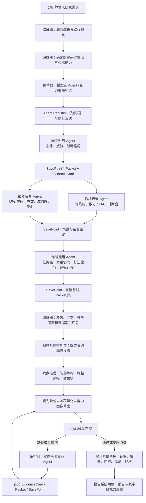
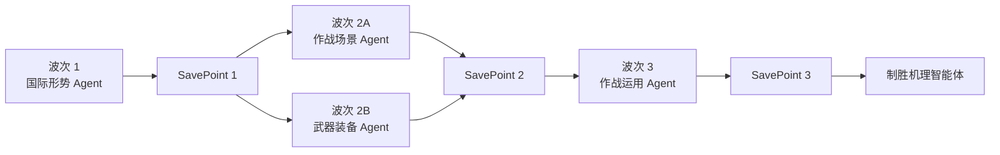
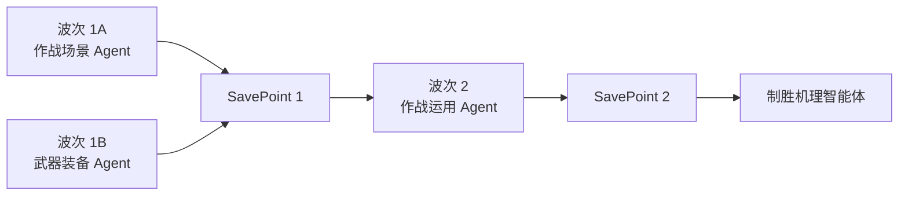
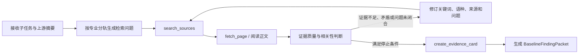
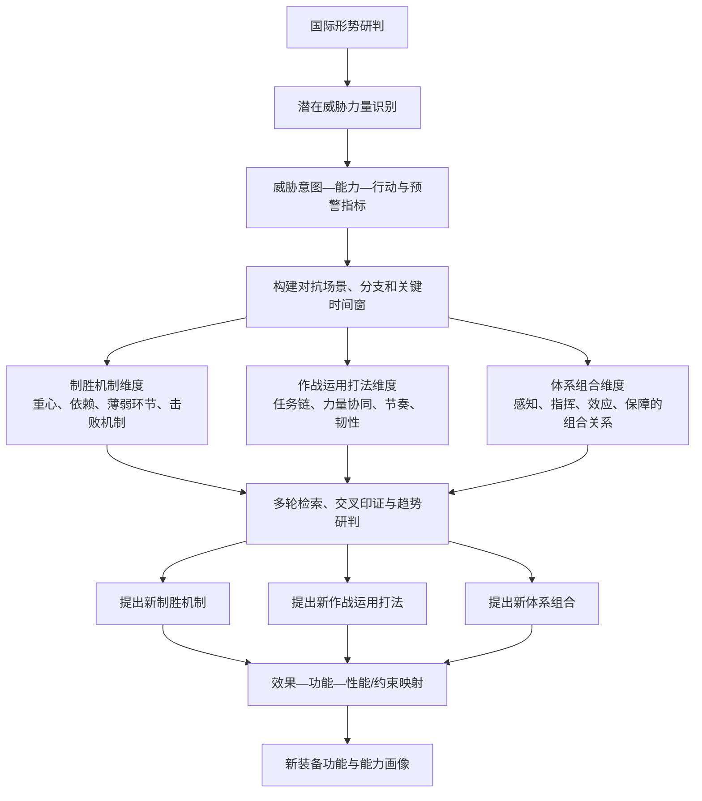
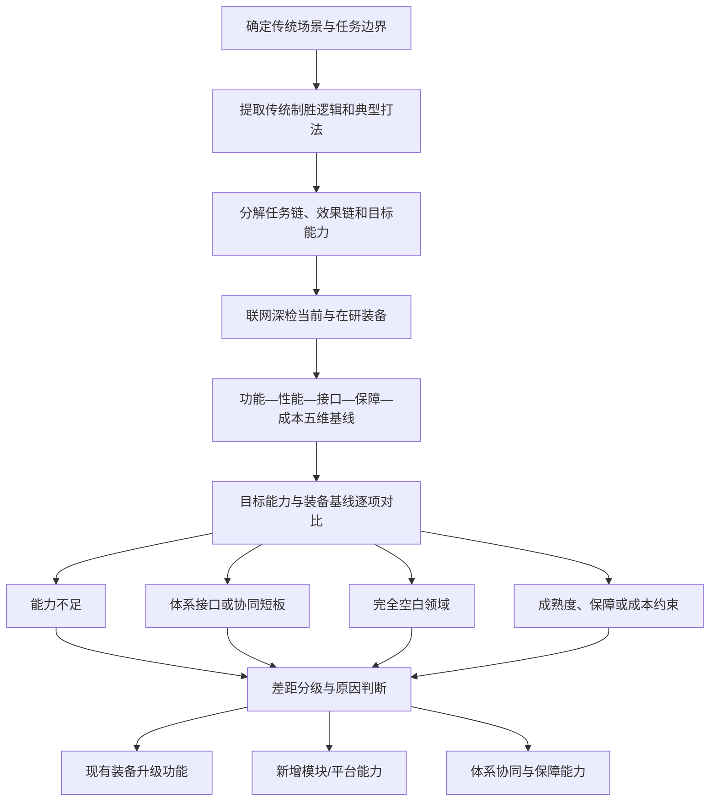
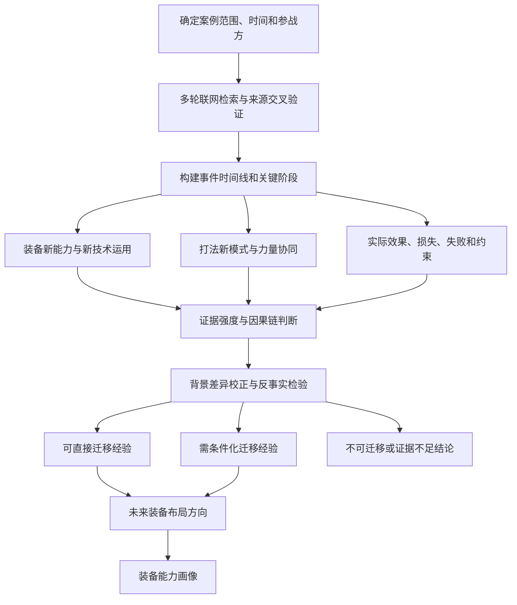
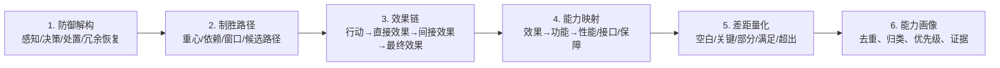

# 任务驱动多智能体执行流程（细化版）

> 可视化全景：[各 Agent 真实执行流程](../../output/html/各Agent执行流程.html)

## 1. 系统目标与执行原则

分析师输入装备研究需求后，系统不是让一个大模型一次性生成结论，而是由**编排器**把任务解析为研究路线、能力覆盖和依赖图，选择若干专业 Agent 分波次开展公开资料研究，再由**制胜机理智能体**把态势、威胁、场景、装备和运用发现转化为可追溯的制胜逻辑与装备能力需求。

系统最终需要回答：

> 面向什么国际形势、潜在威胁和作战场景，需要形成什么新的制胜机制、作战运用打法或体系组合？现有装备存在哪些不足或空白？未来应发展具备什么功能、性能边界和体系接口的装备产品？上述判断由哪些公开证据支撑？

执行遵循五项原则：

1. **路线驱动**：三条算法路线使用不同的问题链、必需能力标签和推理重点。
2. **专业分工**：国际形势、作战场景、武器装备、作战运用分别建立专业基线，不由编排器代替专业研判。
3. **结构化交接**：Agent 之间只传递结构化发现、证据 ID、置信度和开放问题，不共享原始会话。
4. **证据驱动**：重要判断必须关联 EvidenceCard；缺证、冲突和低置信结论进入再检索或受限说明。
5. **制胜牵引**：能力需求必须能够回溯到“威胁—场景—制胜逻辑—效果—功能—差距”链路。

## 2. 真实执行主链

### 2.1 全景主链

> 上图展示完整能力链。实际运行会根据路线和分析师选择裁剪 Agent。例如传统能力缺口路线、局部战争案例路线通常不强制选择国际形势 Agent；未被选择的 Agent 不会伪造输出，其能力缺口会进入门控、再调或报告限制。

### 2.2 编排器的十二个真实控制阶段

| 阶段 | 编排器动作 | 关键输入 | 关键输出 |
| --- | --- | --- | --- |
| 1. 接收任务 | 创建 ResearchProblem 和运行工作区 | 主题、指定路线、指定 Agent、轮次、执行模式 | run id、初始 checkpoint |
| 2. 路线解析 | 将 `auto` 或人工路线解析为三条研究路线之一 | 主题关键词、用户选择 | resolved route |
| 3. 路线约束展开 | 按路线计算必需能力覆盖；问题链用于算法语义和展示对齐 | presets.yaml、路线语义 | required capability tags、研究重点 |
| 4. Agent 判别 | 模型分析候选 Agent；Fake 模式按能力最小覆盖选择 | Agent 描述、技能、工具、能力标签 | 首选 Agent 集及理由 |
| 5. Coverage 校验 | 检查路线必需能力；非人工指定模式可补选 | required tags、selected agents | coverage、missing tags |
| 6. 依赖编排 | 根据 `handoff_policy.wait_for` 做拓扑排序 | agents.yaml | 可并发执行的 Agent waves |
| 7. 分波执行 | 同波 Agent 并发、跨波串行 | ContextPack、工具权限、预算 | Agent session、EvidenceCard、Packet |
| 8. 安全提交 | 每波完成后批量持久化领域对象、trace 和 checkpoint | wave reports | SavePoint |
| 9. 基线汇总 | 只读取结构化 Packet 和证据索引，不读取原始会话 | BaselineFindingPacket[] | WinningMechanismInput |
| 10. 制胜推理 | 执行制胜机理系统智能体逻辑，完成资源投影、六步推理和 L1/L2/L3 | 输入包、证据、覆盖度 | 阶段输出、RecallRequest、能力画像 |
| 11. 再调恢复 | 将 RecallRequest 路由至已选 Agent，补证后从最早层恢复 | target agent/tag、return_node | 新 Packet、补充证据、恢复结果 |
| 12. 审计交付 | 执行审计与报告系统角色，生成可交付产物 | 门控、证据、能力画像、trace | approved/limited、报告、JSON/JSONL |

## 3. 编排器、专业 Agent 与系统 Agent 的职责

### 3.1 编排器：控制面，不代替专业分析

编排器负责“谁来研究、先后如何、缺什么、何时停止”，主要工作包括：

- 解析研究主题，判定 `new_winning_mechanism`、`traditional_gap` 或 `war_case_learning`；
- 根据路线计算必需能力标签，并以路线问题链约束研究语义和交付重点；
- 从 Agent Registry 中选择最小且充分的 Agent 集；
- 依据 `wait_for` 生成执行波次，在依赖安全的前提下并发；
- 为每个 Agent 构建受限 ContextPack，冻结工具、预算和可见上下文；
- 接收 Packet，检查覆盖度、证据引用、冲突、开放问题和置信度；
- 生成 `WinningMechanismInput`，调用制胜机理系统智能体逻辑；
- 路由再调请求、管理轮次和恢复节点；
- 委派审计与报告，形成最终交付物。

编排器不会直接修改专业 Agent 的研究结论，也不会把某个 Agent 的原始模型消息交给另一个 Agent。

### 3.2 国际形势 Agent：回答“未来要面对谁、为什么、何时可能发生”

核心任务：

- 研判国际安全态势、联盟与战略格局；
- 识别潜在威胁力量、能力建设方向和部署演训动向；
- 建立行为体“意图—能力—行动”证据链；
- 识别危机升级路径、触发条件、预警指标和替代假设；
- 按近期、中期、远期描述威胁形成节奏；
- 提炼对场景构建和装备需求的牵引因素。

主要检索分轨：战略政策与联盟、力量建设与部署演训、装备采购与工业基础、新兴技术与作战概念、危机事件与对手表态。

输出重点：`situation_assessment`、`threat_assessment`、`strategic_pattern`、`opponent_moves`，以及证据、置信度和开放问题。

### 3.3 作战场景 Agent：回答“在什么条件下、经历哪些阶段、承受什么压力”

核心任务：

- 把国际形势和威胁判断转化为可分析的对抗场景；
- 明确背景、参与力量、任务目标、触发器、终止条件和胜负判据；
- 构建最可能、最危险和替代场景分支；
- 研判敌方可能行动方案、关键节点、时间窗口和可观测指标；
- 纳入无人化、智能化、强电磁、网络受限、复杂地形等环境约束；
- 将场景压力映射到感知、决策、处置、协同和保障需求。

主要检索分轨：近年公开战例、现代演训与作战概念、无人和智能系统运用、电磁网络与太空约束、典型复杂环境变化。

输出重点：`scenario_framework`、`enemy_coa`、`critical_timeline`、`environment_constraints`。

### 3.4 武器装备 Agent：回答“现有和在研装备能做到什么、做不到什么”

核心任务：

- 建立国内外公开现役、在研装备和关键子系统基线；
- 对型号、批次、参数区间、任务载荷和体系接口做归一化；
- 比较功能、性能、体系接口、保障和成本，不只比较单一参数；
- 研判技术成熟度、工业基础、采购部署和能力形成时间；
- 识别对手装备优势、依赖、局限和防御性应对需求；
- 将场景所需能力与当前装备能力进行差距映射。

主要检索分轨：现役型号与部署规模、在研项目与采购预算、参数和载荷、体系接口、成熟度与保障约束。

输出重点：`current_parameters`、`development_models`、`technology_readiness`、`capability_constraints`。

### 3.5 作战运用 Agent：回答“力量如何组合、采用何种打法、为什么有效或失效”

核心任务：

- 综合态势、场景和装备 Packet，构建任务链和力量关系；
- 比较基线、弹性分布和资源受限等不同运用方案；
- 分析跨域、跨平台、有人无人、传感器—指挥—效应器—保障协同；
- 识别指挥关系、信息流、接口、节奏、部署和持续保障约束；
- 从公开战例中提取可迁移经验、失败模式和适用边界；
- 将打法要求转化为装备功能、体系接口和保障条件。

主要检索分轨：公开战例复盘、联合与多域概念、有人无人协同、指挥控制与保障韧性、持续作战和战损恢复。

输出重点：`operational_constraints`、`force_coordination`、`coa`、`lessons`。

### 3.6 制胜机理系统智能体：把研究发现转化为“为什么能赢、需要什么能力”

制胜机理系统智能体不替代四类基线 Agent 做搜索，而是消费已接纳的 Packet、证据索引、coverage、冲突和开放问题，承担跨专业综合推理：

- 识别敌方重心、体系依赖、薄弱环节和关键时间窗口；
- 从**制胜机制、作战运用打法、体系组合**三个维度形成候选假设；
- 建立“行动—直接效果—间接效果—最终效果”的效果链；
- 把效果转换为装备功能、性能指标方向、体系接口和保障条件；
- 与现有/在研能力对比，形成五档差距判断；
- 生成 L1/L2/L3 阶段结果、再调请求和九字段能力画像。

当前真实实现中，这一角色已在 Agent Registry 中定义为 `winning_mechanism`，并在交互时间线中以系统智能体留痕；但主链不是再启动一次独立模型会话，而是由 `WinningMechanismEngine` 和 `SixStepReasoner` 在进程内确定性执行。这样可以保证阶段对象、门控和恢复行为稳定可审计。若后续改为独立模型 Agent，其输入输出契约仍保持不变。

### 3.7 审计与报告系统角色

- **审计系统角色**：检查证据支撑、能力覆盖、门控结果、对象追溯、轮次约束和材料化状态，输出 `approved` 或 `limited`。
- **报告系统角色**：只基于已经审计的证据、阶段输出和能力画像生成研究报告，不重新发明结论。

当前主链分别由 `audit_run()` 和 `render_report()` 直接执行，同时写入“委派审计/报告 Agent”的 Trace 事件；它们尚不是独立的模型 Agent 回合。

## 4. 路线解析与 Agent 选择

### 4.1 三条算法路线

| 主题信号 | 路线 | 必需能力 | 核心问题链 |
| --- | --- | --- | --- |
| 新机制、新体系、新概念、未来威胁 | `new_winning_mechanism` | situation、threat、scenario、equipment、operation | 形势与威胁 → 对抗场景 → 防御解构 → 新制胜机制/新打法/新体系组合 → 装备功能 |
| 传统、现有、升级、缺口、不足、空白 | `traditional_gap` | scenario、equipment、capability_gap、operation | 传统场景 → 传统制胜与战法 → 当前装备 → 目标能力 → 差距与空白 → 升级功能 |
| 战例、战争、案例、经验教训 | `war_case_learning` | lessons、operation、equipment、scenario | 案例时间线 → 参战力量与装备 → 新打法 → 效果与不足 → 可迁移方向 → 能力画像 |

> `routes.yaml` 已配置上述路线问题链和必需输出，当前主要用于路线语义定义和测试对齐；`DeepResearchRunner` 的真实运行差异目前主要由自动路线解析、`presets.yaml` 的 capability 覆盖、L2 路线验证标签以及路线专属能力画像逻辑落实。文档将问题链作为算法模块说明，不将其误写成一个已经独立调度的运行节点。

### 4.2 Agent 选择方式

- **分析师显式指定**：严格使用指定 Agent；编排器仍做依赖和 coverage 校验，但不擅自补选，缺口进入限制说明。
- **Responses 正式模式**：模型结合主题、路线、候选 Agent 的技能和工具给出首选集合；编排器再按必需 capability 做安全补选。
- **Fake/Smoke 模式**：采用 capability 最小覆盖算法，形成确定性演示结果。
- **再调阶段**：优先使用 `target_agent_id`；未指定时按 `target_capability_tag` 在已选 Agent 中路由。

### 4.3 默认组合与裁剪逻辑

| 路线 | 通常选择的 Agent | 裁剪说明 |
| --- | --- | --- |
| 新制胜机理 | 国际形势 + 作战场景 + 武器装备 + 作战运用 | 国际形势和威胁是路线必需基线 |
| 传统能力缺口 | 作战场景 + 武器装备 + 作战运用 | 若任务涉及战略演变或远期威胁，可补国际形势 |
| 局部战争案例 | 作战场景 + 武器装备 + 作战运用 | 若需研判战争外溢、联盟或长期战略影响，可补国际形势 |

## 5. 分波次执行、并发和 SavePoint

真实执行顺序由 Agent Registry 的 `handoff_policy.wait_for` 决定，而不是由模型临时建议决定。

当前默认依赖为：

- 国际形势 Agent：无前置依赖；
- 作战场景 Agent：等待国际形势 Agent（前提是本次选中了国际形势）；
- 武器装备 Agent：等待国际形势 Agent，可读取已经存在的场景交接，但不强制等待场景；
- 作战运用 Agent：等待本次被选择的国际形势、作战场景和武器装备 Agent。

因此，完整四 Agent 组合的实际波次是：

传统能力缺口或局部战争案例未选择国际形势 Agent 时，实际波次通常是：

执行约束：

- 同一波次使用线程池并发执行；
- 波次之间串行，下一波只读取上一 SavePoint 已提交的数据；
- 波次内任一 Agent 失败，该波不作为完整状态提交；
- 恢复时从上一个已完成 SavePoint 继续，避免使用半完成结果；
- 原始 session 按 Agent 独立保存，跨 Agent 交接只使用白名单字段。

## 6. 专业 Agent 内部的多轮深度研究

每个基线 Agent 使用独立的角色配置、ContextPack、模型预算、工具权限、工作 checkpoint 和 JSONL Session。当前真实主链由 `DiscoveryScheduler` 调度各 Agent，并在执行层落实上下文隔离、证据治理和 SavePoint；通用 `AgentHarness` 类尚未直接实例化到该主链中。

其专业研究方法可概括为：

“多轮次的信息检索”需要区分当前已落地能力与可扩展研究循环：

1. **单次专业 Agent 执行中的深度检索**：Real Responses 模式允许 Agent 使用公开检索能力，角色配置定义多条检索分轨、来源数量、反证要求和停止条件；具体搜索步数由模型和工具调用结果决定。
2. **跨 Agent 定向再调轮（已接入主链）**：制胜机理 L1/L2/L3 发现证据或能力覆盖缺口后，编排器再次调用指定 Agent 补证，并从对应层恢复推理。
3. **通用自主研究循环（预留能力）**：仓库中已有 `ResearchLoop` 等多轮研究组件，但当前 `DeepResearchRunner` 主链尚未调用，因此文档不把它表述为已经执行的固定循环。

统一输出 `BaselineFindingPacket`，至少包含：

- `agent_id` 和 capability tags；
- 专业发现 `findings` 与结构化 `analysis_sections`；
- EvidenceCard ID 和 claim ID；
- 置信度、覆盖说明和限制；
- 开放问题和下游交接摘要；
- Agent 工作 checkpoint。

## 7. 算法路线一：新制胜机制、新打法和新体系组合

### 7.1 目标

从国际形势和潜在威胁力量出发，构建与之对抗的作战场景，围绕制胜机制、作战运用打法和体系组合开展多轮研究与深度推理，提出新的能力增长点和装备能力需求。

### 7.2 模块化执行流程

### 7.3 各 Agent 在该路线中的工作

1. **国际形势 Agent**先建立战略态势、潜在威胁力量、能力形成节奏和预警指标，为后续场景限定“对手、时间和强度”。
2. **作战场景 Agent**把威胁转化为危机前预警、初始接触、体系对抗、持续作战和战损重构等阶段，形成多个场景分支与关键压力点。
3. **武器装备 Agent**研究对手现役/在研装备、技术趋势、体系接口和能力边界，同时建立可用于后续差距分析的装备基线。
4. **作战运用 Agent**综合前三路 Packet，比较不同任务组织、协同关系、部署原则、资源约束和失败模式，形成打法与体系组合候选。
5. **制胜机理智能体**并行审视三个创新空间：
   - 新制胜机制：改变对抗中的关键因果关系或优势形成方式；
   - 新作战运用打法：改变任务链、协同方式、节奏或资源使用方式；
   - 新体系组合：重构感知、指挥、效应、保障等能力单元的连接与组合。
6. 对候选方向建立效果链，剔除只有概念表述、无法落到功能或缺少证据的方向，最终形成新装备能力需求。

### 7.4 该路线的关键输出

- 国际态势与潜在威胁力量清单；
- 场景树、关键时间窗和能力压力点；
- 新制胜机制候选及其因果链；
- 新作战运用打法及适用条件；
- 新体系组合、体系接口和依赖关系；
- 对应的装备功能、性能方向、成熟度与优先级；
- 每项结论的证据、置信度、假设和开放问题。

## 8. 算法路线二：基于传统打法的装备能力缺口与拓展需求

### 8.1 目标

在明确的传统场景、传统制胜逻辑和传统作战打法下，通过联网深度检索建立当前装备基线，把目标场景所需能力与现有/在研能力逐项比较，挖掘能力不足、体系短板和空白领域，提出装备升级与新能力拓展需求。

### 8.2 模块化执行流程

### 8.3 各 Agent 在该路线中的工作

1. **作战场景 Agent**固定传统场景、任务阶段、环境条件和成功判据，避免装备比较脱离使用条件。
2. **武器装备 Agent**是该路线的重点 Agent，联网检索现役与在研型号，记录参数区间、型号批次、来源日期、成熟度、体系接口和保障成本。
3. **作战运用 Agent**提取传统打法下的任务链、力量协同、部署原则和失败模式，确定装备能力不是“参数更大”而是“任务效果是否可达成”。
4. **国际形势 Agent**为可选补充，当任务涉及长期威胁演变、装备代际窗口或战略环境变化时启用。
5. **制胜机理智能体**以传统制胜逻辑为基准，不强行创造新概念，重点完成目标能力—当前能力—差距—升级功能映射。

### 8.4 五档差距与需求类型

| 差距档位 | 含义 | 典型输出 |
| --- | --- | --- |
| 空白 | 当前没有可用能力或体系节点 | 新增装备、新任务载荷或新能力模块 |
| 关键差距 | 对任务成败具有决定性影响 | 优先升级的核心功能与性能方向 |
| 部分差距 | 特定环境、强度或持续时间下不足 | 环境适应、抗干扰、持续保障等增强功能 |
| 满足 | 当前能力基本达到目标 | 保持、标准化、接口优化或成本改进 |
| 超出 | 能力高于当前场景需求 | 评估成本、资源配置和跨场景复用价值 |

最终需求需明确区分：

- **现有装备升级**：软件、算法、任务载荷、接口、可靠性、保障和协同能力升级；
- **新能力补位**：现有装备无法通过合理升级覆盖的能力空白；
- **体系能力建设**：问题不在单装，而在信息流、指挥关系、跨平台接口或保障链。

## 9. 算法路线三：国际局部战争案例学习

### 9.1 目标

针对国际局部战争案例进行多轮联网检索，建立可追溯的案例时间线和证据链，总结装备新能力、打法新模式、实际效果、经验与不足，校正案例背景差异后研判未来可布局方向，提出装备能力画像。

### 9.2 模块化执行流程

### 9.3 各 Agent 在该路线中的工作

1. **作战场景 Agent**重建案例的阶段、环境、参战力量、任务目标和关键时间窗，防止只摘取孤立事件。
2. **武器装备 Agent**核验案例中出现的型号、载荷、参数、部署方式、技术成熟度和能力边界，区分宣传口径与可验证事实。
3. **作战运用 Agent**提取新打法、协同模式、任务链变化、失败模式和经验教训，并做适用边界分析。
4. **国际形势 Agent**为可选补充，用于分析联盟介入、战略外溢、威胁演变和未来力量建设影响。
5. **制胜机理智能体**把案例事实组织为“采用了什么行动—产生了什么效果—依赖什么能力—暴露什么不足—哪些经验可迁移”，再映射到未来布局方向。

### 9.4 案例证据控制

- 时间线中的关键事件需要来源和日期；
- 装备型号、战果和损失信息需保留来源冲突，不以单一报道定论；
- “同时发生”不直接等于“因果关系”，需要机制解释或多源支撑；
- 经验迁移必须说明原案例与目标场景在地理、对手、强度、体系和保障条件上的差异；
- 无法核验的战果、参数和传闻只作为开放问题，不进入正式能力结论。

## 10. 制胜机理系统智能体内部算法

### 10.1 输入包与上下文隔离

编排器生成 `WinningMechanismInput`，其中只包含：

- 研究主题和路线；
- 已接纳的 BaselineFindingPacket ID；
- 证据索引和 claim 引用；
- capability 覆盖度与缺失项；
- 发现之间的冲突和开放问题；
- 当前轮次、最大轮次和恢复信息。

制胜机理系统智能体逻辑不读取其他 Agent 的原始 session，因此其综合结论可追溯到明确的结构化输入，而不是隐式共享的长上下文。

### 10.2 四类资源动态投影

每次首轮分析或再调恢复，系统都针对本次任务动态生成 `WinningKnowledgeProjection`：

| 资源 | 作用 |
| --- | --- |
| 理论工具 | 防御分层、重心与击败机制、效果链、效果—功能—性能映射、五档差距评估 |
| 战例资源 | 支撑经验验证、失败分析、跨场景迁移和反事实检查 |
| 前沿情报 | 支撑新概念、新技术、新手段、成熟度和未来趋势研判 |
| 问题链 | 将路线问题、coverage 缺口和各 Agent 开放问题组织为待闭合问题 |

这些资源是本次运行的证据和方法投影，不等同于另建一个脱离证据的静态知识库。

### 10.3 六步制胜推理

1. **防御解构**：按感知、决策、处置、冗余/恢复分层描述对抗体系，找出主要压力、依赖和薄弱环节。
2. **制胜路径**：结合路线形成候选路径。新制胜路线关注新机制、新打法和新体系组合；传统路线关注基线打法与装备差距；案例路线关注事实效果与经验迁移。
3. **效果链**：说明某种行动通过什么中间效果形成最终任务效果，避免直接从技术名词跳到装备需求。
4. **能力映射**：将效果逐项转换为功能、性能方向、体系接口、环境适应和保障约束。
5. **差距量化**：将目标能力与现有/在研装备比较，标记差距等级、证据强度和不确定性。
6. **能力画像**：去重归并，形成新作战能力方向、现有装备升级需求和体系能力建设项。

每个推理节点记录 `input_refs`、EvidenceCard ID、claim ID、置信度、假设和研究路线。

### 10.4 L1/L2/L3 门控

| 层级 | 核心问题 | 主要输出 | 不通过时的再调方向 |
| --- | --- | --- | --- |
| L1 制胜逻辑 | 威胁—场景—制胜路径—效果链是否闭合 | 弱点地图、制胜路径、效果链、关键能力、假设 | 补态势、威胁、场景或运用证据 |
| L2 概念与可行性 | 新机制/打法/体系组合或升级方向是否具备技术和工程可行性 | 新概念、新技术、新手段、成熟度、约束 | 补装备、成熟度、试验、工程和保障证据 |
| L3 能力画像 | 能力差距、装备基线、优先级和证据追溯是否完整 | 九字段能力画像、差距和优先级 | 补参数、装备基线、接口和差距证据 |

## 11. 定向再调与恢复

首轮完成 L1/L2/L3 后，系统集中收集各层 `RecallRequest`。请求至少包含：来源层、目标 Agent 或 capability、原因、所需数据、紧迫度和 `return_node`。

真实处理流程：

1. 编排器按 `target_agent_id` 路由；若未指定，则按 `target_capability_tag` 在已选 Agent 中查找；
2. 可路由请求逐个执行，Agent 获得原任务、再调原因、所需数据、证据索引和自身 checkpoint；
3. Agent 重新检索并生成新的 EvidenceCard 与带轮次标识的 Packet；
4. 补充结果提交 SavePoint；
5. 系统选择所有已完成请求中最早的 `return_node`，从 L1、L2 或 L3 恢复；
6. 无可用 Agent 时生成 `AgentRecommendation`，提示启用或新增具备相应能力标签的 Agent；
7. 达到最大轮次或同目标次数上限后不再无限循环，结论转为受限。

系统配置支持最多 5 轮、同目标最多 3 次；当前主流程采用“一次集中再调 + 一次分层恢复分析”的收敛方式。

## 12. 证据治理与审计

### 12.1 EvidenceCard

每条正式证据至少记录：来源、URL/路径、正文摘录、位置、日期、质量判断、支撑 claim 和创建 Agent。网页或文档正文材料化到 `artifacts/`，报告引用 EvidenceCard，不引用模型口述来源。

### 12.2 六项交付审计

最终审计检查：

1. 阶段输出是否完整；
2. 最低置信度是否达到 70%；
3. 路线必需 capability 是否覆盖；
4. 分析师是否确认；
5. 实际轮次是否超过约束；
6. 证据是否成功材料化并可追溯。

六项全部通过时为 `approved`；任一项未通过时为 `limited`，只能作为受限结论、待补证结果或待审稿，不得伪装为完整结论。

## 13. 交付成果与九字段能力画像

运行交付物：

- `report.md`：研究报告；
- `capability_images.json`：九字段能力画像；
- `round_summary.json`：路线、Agent、阶段、再调和审计摘要；
- `domain.jsonl`：ResearchProblem、EvidenceCard、Packet、阶段输出等领域对象；
- `trace.jsonl`：委派、工具、SavePoint、门控、再调、审计和报告事件链；
- `agent_sessions/`：各 Agent 相互隔离的 JSONL 会话；
- `artifacts/`：网页、文档和正文材料；
- `checkpoints/`、`run.db`：恢复和持久化数据。

能力画像九字段：

1. 能力编号；
2. 名称；
3. 装备类别；
4. 类型；
5. 来源制胜逻辑；
6. 关联场景；
7. 优先级；
8. 能力差距；
9. 能力画像。

每项能力画像还需要通过证据 ID、claim ID 和推理节点引用回溯其形成过程。

## 14. 三条路线与系统模块的对应关系

| 算法要求 | 主要负责模块 | 核心领域对象/产物 |
| --- | --- | --- |
| 国际形势研判 | 国际形势 Agent | situation/threat/strategy Packet |
| 找到潜在威胁力量 | 国际形势 Agent + 编排器问题链 | threat assessment、预警指标、开放问题 |
| 设定对抗作战场景 | 作战场景 Agent | scenario framework、enemy COA、timeline |
| 从制胜机制深度思考 | 制胜机理智能体 L1 | 重心、依赖、制胜路径、效果链 |
| 从作战运用打法深度思考 | 作战运用 Agent + 制胜机理智能体 | COA、协同、约束、打法候选 |
| 从体系组合深度思考 | 作战运用 Agent + 武器装备 Agent + 制胜机理智能体 | 任务链、体系接口、能力单元组合 |
| 多轮信息检索 | 各专业 Agent Harness + RecallCoordinator | EvidenceCard、Packet、RecallRequest |
| 信息整合与趋势研判 | 编排器汇总 + 四类资源投影 | WinningMechanismInput/Projection |
| 提出新机制、新打法、新体系 | 制胜机理六步推理与 L1/L2 | stage outputs、reasoning nodes |
| 当前装备联网深检和对比 | 武器装备 Agent | 参数、型号、成熟度、能力约束 |
| 挖掘不足或空白 | 差距量化 + L3 | gap matrix、能力画像 |
| 局部战争案例分析 | 场景、装备、运用 Agent | 时间线、新能力、新打法、经验不足 |
| 研判未来布局方向 | 制胜机理智能体 | 新能力方向、升级需求、体系建设项 |
| 输出装备能力图像 | L3 + 报告系统角色 | capability_images.json、report.md |

## 15. 实际程序运行案例

需求：评估现有机场低空防护系统应对多批次低慢小目标的能力缺口，并提出未来三至五年升级功能。

| 项目 | 实际结果 |
| --- | --- |
| 路线 | `traditional_gap` |
| Agent | 作战场景、武器装备、作战运用 |
| 国际形势 Agent | 未选择，任务未要求宏观态势研判 |
| 执行时序 | 场景与装备并发 → SavePoint → 作战运用串行 |
| 证据 | 3 条离线演示 EvidenceCard |
| L1/L2/L3 | 全部通过，置信度 0.78 |
| 再调 | 0 次 |
| 审计 | `approved` |

输出两类能力方向：

1. **新能力补位**：专用探测、快速接入既有指挥链、模块化任务载荷和低成本补位。
2. **现有装备升级**：复杂环境识别、抗干扰通信、跨平台协同、任务重构和持续保障。

> 案例来自 Fake 模式的真实程序运行，用于验证编排、Agent、SavePoint、制胜推理和交付链路；离线 fixture 不代表已完成真实联网研究。

## 16. 总结

> 系统以编排器为控制面，以国际形势、作战场景、武器装备和作战运用 Agent 为专业研究面，以制胜机理智能体为跨专业推理核心。三条算法路线共享同一套“任务解析—多 Agent 检索—结构化交接—制胜推理—门控再调—审计交付”底座，但分别突出新机制创新、传统装备差距和战争案例学习，最终把公开证据转化为可追溯、可审计、可落到产品功能的装备能力画像。
