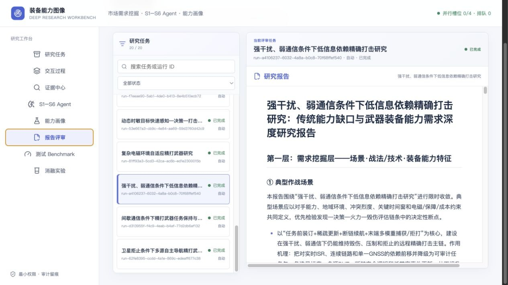
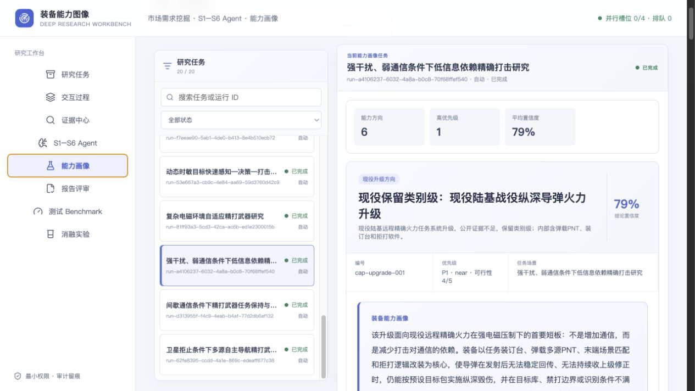
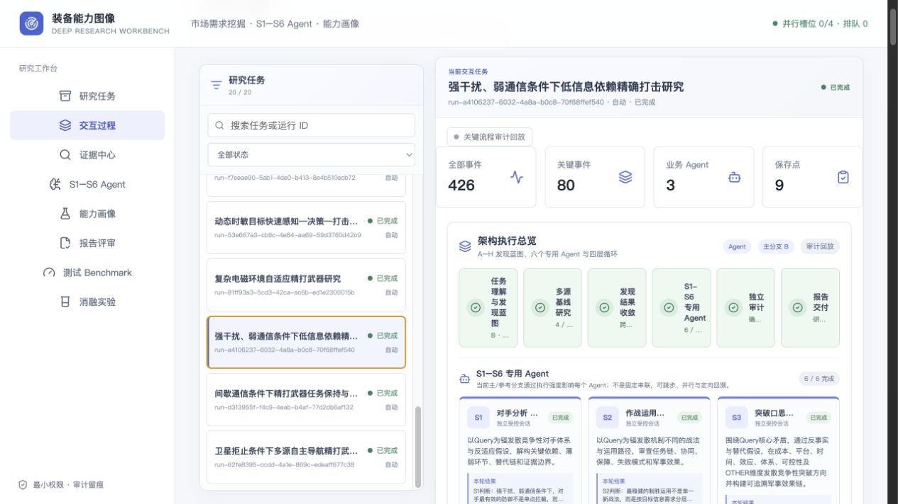
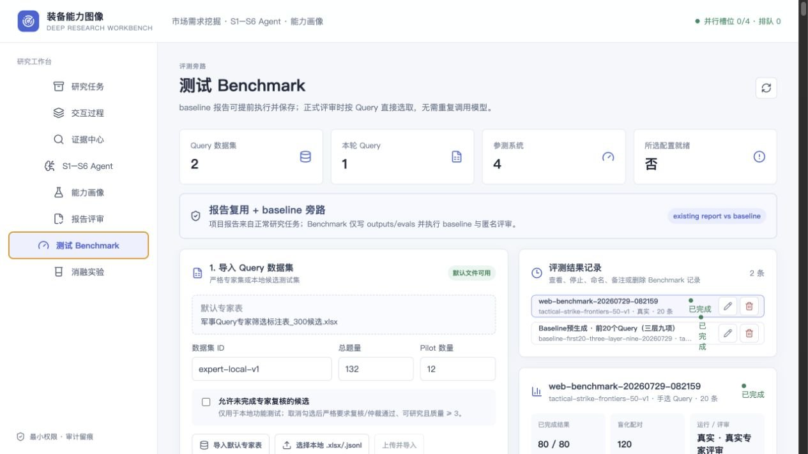
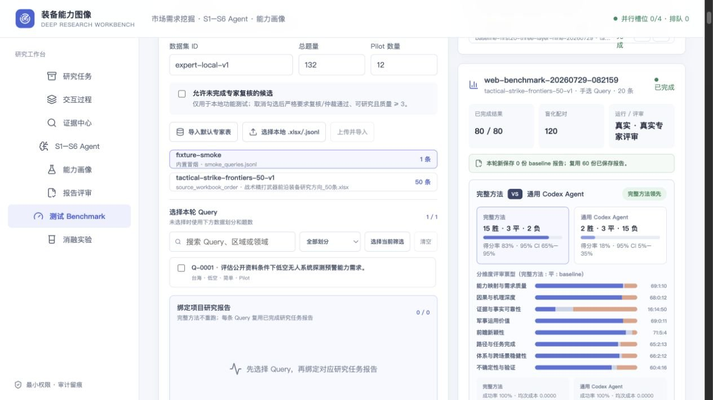
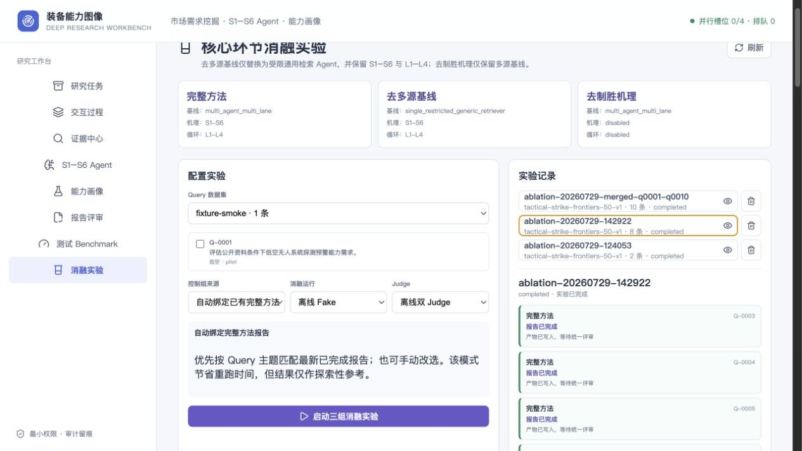
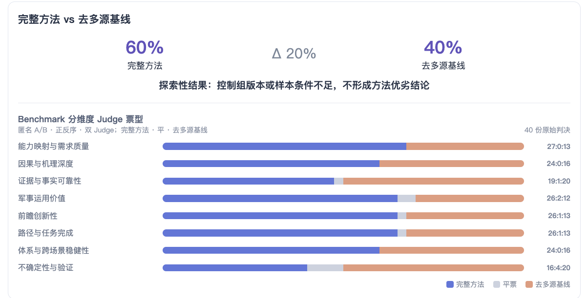
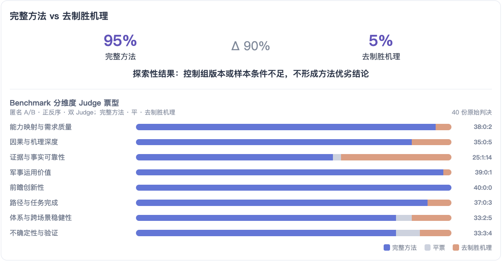

# 副本市场需求发散要求落实与评测汇报_增强版_20260729

- Source: `副本市场需求发散要求落实与评测汇报_增强版_20260729.pptx`
- Total slides: 19

## Slide 1

阶段评审 · 2026.07

市场需求发散要求落实与评测汇报

项目落实 · Benchmark · 消融实验

01

02

03

三层九项已落地

Benchmark 初步领先

补证据与效率

需求合同与工程闭环具备运行验收证据

对最强通用 Agent 得分率 82.5%

扩大样本并降低平均时延

装备能力图像 · 市场需求挖掘项目

01

### Speaker Notes

本次汇报聚焦三个问题：文档中的发散要求是否真正落地，完整方法在 Benchmark 中表现如何，以及关键模块到底贡献了什么。当前结论是，三层九项、制胜机理和评测闭环已经形成可运行系统，并获得初步效果证据。下一阶段的重点不是继续增加复杂度，而是补强证据质量、扩大样本并降低运行时延。

## Slide 2

核心结论

02

01

82.5%

03

主链已跑通

初步效果领先

短板已暴露

A–H 发散路径

事实证据 16:14:50

对通用 Agent

三层九项 · S1–S6

15 胜 · 3 平 · 2 负

平均耗时 22.9 分钟

L1–L4 · 审计恢复

Bootstrap 95%：65%–95%

规模化验证的核心约束

release_ready = true

建议决策：优先启动证据质量专项、50 条全量 Benchmark、同版本消融复测

### Speaker Notes

先看三点结论。第一，A 到 H 的研究路径、三层九项、S1 到 S6、L1 到 L4，以及审计恢复能力已经具备；第二，对最强通用 Agent 的得分率为百分之八十二点五；第三，事实证据维度和二十二点九分钟的平均耗时仍是规模化验证的主要约束。

## Slide 3

原始需求拆解

03

从“开放发散”转化为“固定验收”

四类发散输入

五项验收标准

01 领域属性符合性

研究路径发散

1

收敛为

02 装备能力图像

场景与战法发散

2

统一验收口径

03 制胜效能

装备能力与技术发散

3

04 创新性

验证与交付发散

4

05 可实现性 / 成熟度

来源：市场需求 query 及模板 V2

### Speaker Notes

原始文档允许研究路径、场景战法、装备技术和验证交付充分发散，但最终必须回到五项业务验收。成果必须真正符合领域属性，形成装备能力图像，论证制胜效能，同时兼顾创新性和可实现性。这个拆解决定了项目不是一般性的资料检索工具。

## Slide 4

发散要求落实矩阵

04

工程状态

三层九项交付合同

TRUE

第一层 · 需求挖掘

第二层 · 技术攻关

第三层 · 装备决策

① 场景 ② 战法/机理

④ 实现途径 ⑤ 核心技术

⑦ 装备映射 ⑧ 演示验证

runtime_complete

③ 能力特征

⑥ 耦合短板

⑨ 优先级抓手

TRUE

关键运行验收

release_ready

A–H 路由检查

六步推理检查

九字段能力画像

证据引用与绑定

审计与恢复

并发与任务编排

审计状态

APPROVED

主要验收项均为 true

来源：architecture-acceptance.json；市场需求 query 及模板 V2

### Speaker Notes

从落实情况看，需求层、技术层和装备决策层都已经映射成明确产物。运行验收显示，A 到 H 路由、六步推理、九字段能力画像、证据、审计、恢复和并发等主要检查均已通过。当前运行完成、发布就绪和审计批准状态都已经形成工程证据。

## Slide 5

项目主链已形成闭环

05

从 Query 到能力画像，每一步都有结构化产物与审计状态

RESEARCH LANES

MECHANISM

DELIVERY CONTRACT

1

2

3

4

5

输入

研究

推理

交付

审计

Query / 模板

A–H 路由 · 多源

S1–S6 制胜机理

三层九项 · 能力画像

L1–L4 · 恢复

形成“可追溯、可复核、可恢复”的研究闭环

### Speaker Notes

项目主链从 Query 和模板开始，经由 A 到 H 路由与多源研究，进入 S1 到 S6 的制胜机理推理，再输出三层九项报告和能力画像。最后通过 L1 到 L4 完成复核、审计和恢复。这样每一步都有结构化产物，也能追溯结论来自哪里。

## Slide 6

三层九项把发散研究约束为可验收产物

06

研究路径可以发散，交付结构与验证口径保持稳定

固定合同

第三层 · 装备决策

⑦ 装备映射 ⑧ 演示验证 ⑨ 优先级抓手

每项都有输入

每项都有产物

第二层 · 技术攻关

每项都有验证

④ 实现途径 ⑤ 核心技术 ⑥ 耦合短板

S1–S6

机理收敛

第一层 · 需求挖掘

L1–L4

质量回路

① 典型场景 ② 战法/制胜机理 ③ 能力特征

三层结构保证发散研究最终回到可验收的装备需求成果

### Speaker Notes

三层九项的作用，是允许研究过程发散，同时保证交付不会失控。需求挖掘层回答场景、战法机理和能力特征，技术攻关层回答实现途径、核心技术和耦合短板，装备决策层回答装备映射、演示验证和优先级抓手。S1 到 S6 负责机理收敛，L1 到 L4 负责质量回路。

## Slide 7

核心发散能力已形成可验收前端闭环

07

过程可回放 · 画像可追溯 · 报告可评审

3

类可验收产物

03 研究报告

三层九项正文 · 可直接评审

02 能力画像

6 个装备方向 · 79% 平均置信度

01 交互过程

426 个事件 · 9 个保存点

执行记录

能力收敛

正式交付

### Speaker Notes

前六页说明了系统如何落实要求，这一页开始展示真实产品效果。交互过程、能力画像和研究报告已经形成三类可验收产物，分别对应执行记录、能力收敛和正式交付。后面三页将逐一展开，而不是只停留在架构说明。

## Slide 8

交互过程把复杂研究链变成可审计执行记录

08

架构总览、S1–S6、L1–L4 与关键事件在同一任务中连续呈现

426

全部事件

完整运行轨迹可回放

80

关键事件

快速定位高价值节点

6/6

S Agent

专用分析全部完成

9

保存点

支持恢复与定向复跑

可观察 · 可定位 · 可恢复

真实任务：强干扰、弱通信条件下低信息依赖精确打击研究

### Speaker Notes

代表任务中，前端记录了四百二十六个事件、八十个关键事件、六个已完成的专用 Agent 和九个保存点。架构总览、S1 到 S6 结果、L1 到 L4 循环和关键事件在同一页面连续呈现，因此运行问题可以被观察、定位和恢复。这使复杂研究链具备了工程复盘条件。

## Slide 9

能力画像已能给出装备方向、谱系位置与实现路径

09

从场景与制胜机理，收敛到可排序、可验证的装备能力方向

多

个装备方向

1

个高优先级

79%

平均置信度

能力谱系示例

现役纵深导弹火力升级

低信息远程精确导弹族

低信息侦打巡飞弹

主要集中在无人远程火力打击装备

前端保留：方向编号、优先级、置信度、任务场景、能力描述、核心差距与演化路径

### Speaker Notes

能力画像把研究判断收敛为六个具体装备方向，其中一个被列为高优先级，平均置信度为百分之七十九。每个方向不仅有名称，还保留任务场景、谱系位置、核心差距、作战机理和演化路径。这里展示的价值，是把发散研究转化成可排序、可验证的装备发展候选。

## Slide 10

三层九项已沉淀为可直接评审的深度研究报告

10

统一交付结构覆盖场景、机理、能力、技术、风险与效能贡献

01

需求挖掘层

场景 · 战法/机理 · 能力特征

02

技术攻关层

实现途径 · 核心技术 · 耦合风险

03

能力与效能层

装备画像 · 验证评估 · 优先级抓手

事实 → 推断 → 待验证

正文显式保留证据边界与失效条件

真实报告正文：标题、三级结构、列表与表格均可连续阅读和评审

### Speaker Notes

三层九项已经沉淀为可连续阅读和直接评审的正式报告。第一层组织需求与场景，第二层组织技术攻关和风险，第三层组织能力画像与效能贡献。报告正文同时保留事实、分析推断和待验证假设的边界，避免把概念潜力写成既成能力。

## Slide 11

Benchmark 测试思路

11

真实产物复用 + 匿名 A/B 与 B/A 双顺序盲评

同一 Query，四套系统

完整方法

通用 Codex Agent

纯 LLM

智谱 GLM

匿名双顺序 · 双 Judge

前端真实运行记录：历史 Benchmark、80/80 结果与 120 个盲化配对

20

80

120

2

0

Query

回答

Pair

GPT-5.5 Judge

Judge error

### Speaker Notes

Benchmark 使用同一批二十条 Query 比较四套系统，并复用真实完成的研究报告。总计形成八十份回答和一百二十个盲评配对，由两名 GPT-5.5 评审专家分别执行 A 对 B 和 B 对 A 的双顺序评审。本轮评审错误数为零，前端也保留了完整运行记录。

## Slide 12

从五项要求到八维评测标准

12

不奖励篇幅、格式或术语密度，只判断成果质量

五项业务验收

八维 Pairwise 评测

01 路径与任务完成

02 证据与事实可靠性

01 领域属性符合性

03 因果与机理深度

04 军事运用价值

02 装备能力图像

映射为

03 制胜效能

05 能力映射与需求质量

06 前瞻创新性

可判、可复核

04 创新性

07 体系与跨场景稳健性

08 不确定性与验证

05 可实现性 / 成熟度

总体胜负基于八维加权与硬失败检查

来源：pairwise_prompt_v1 评审口径

### Speaker Notes

五项业务验收进一步拆成八个可判维度，避免只凭总体印象判断。评审关注任务完成、事实证据、因果机理、军事价值、能力映射、前瞻创新、体系稳健和不确定性验证。篇幅更长、格式更复杂或者术语更多，都不会自动获得更高评价。

## Slide 13

Benchmark 总结果

13

完整方法对三类基线均领先

完整方法得分率

97.5%

97.5%

82.5%

前端结果证据：15胜3平2负及八维 Judge 票型

通用 Agent

纯 LLM

智谱 GLM

vs 通用 Agent：15胜3平2负，95% CI 65%–95%

vs 纯 LLM / 智谱：均为19胜1平0负

### Speaker Notes

总体结果显示，完整方法对三类基线均领先。对通用 Agent 是十五胜三平两负，得分率百分之八十二点五，百分之九十五区间为百分之六十五到百分之九十五；对纯 LLM 和智谱 GLM 均为十九胜一平零负，得分率百分之九十七点五。右侧截图展示了前端保存的二十条 Query 真实结果和八维票型。

## Slide 14

对通用 Agent 的八维票型

14

七维领先，一维证据明显落后

最大短板

65:2:13

任务与路径完成

50

16:14:50

证据与事实可靠性

68:0:12

因果与机理深度

baseline 胜票

69:1:10

能力映射与需求质量

证据事实维度

60:4:16

不确定性与验证

正文—证据绑定

69:0:11

军事运用价值

关键数字核验

来源质量分级

71:5:4

前瞻创新性

66:2:12

体系与跨场景稳健

完整方法

平票

通用 Agent

### Speaker Notes

进一步看最强基线，完整方法在任务完成、因果机理、能力映射、军事价值、前瞻性、体系稳健和不确定性七个维度领先。唯一明显反向的是证据与事实可靠性，完整方法、平票、通用 Agent 的票型为十六比十四比五十。这说明下一阶段最优先的工作不是继续增加推理层次，而是把正文结论和可靠证据强绑定。

## Slide 15

对纯 LLM 的八维票型

15

八维全部领先，三个维度获得 80:0:0 全票

全票领先维度

74:0:6

任务与路径完成

3

80:0:0

证据与事实可靠性

个 80:0:0

76:0:4

因果与机理深度

75:0:5

能力映射与需求质量

事实证据

80:0:0

不确定性与验证

不确定性验证

78:0:2

军事运用价值

前瞻创新

80:0:0

前瞻创新性

优势覆盖质量、边界与创新

71:2:7

体系与跨场景稳健

完整方法

平票

纯 LLM

### Speaker Notes

对纯 LLM 的分维度结果显示，完整方法在八个评测维度全部领先。事实证据、不确定性验证和前瞻创新三个维度均为八十比零比零，说明双 Judge 在这三项上全部支持完整方法。其余维度的基线胜票也不超过七票，优势不是由单一维度拉动，而是覆盖任务完成、机理、能力映射和军事价值的整体提升。

## Slide 16

对智谱 GLM 的八维票型

16

八维优势稳定，三项维度获得 80:0:0 全票

全票领先维度

78:0:2

任务与路径完成

3

80:0:0

证据与事实可靠性

个 80:0:0

78:0:2

因果与机理深度

78:0:2

能力映射与需求质量

事实证据

80:0:0

不确定性与验证

不确定性验证

78:0:2

军事运用价值

体系稳健

76:1:3

前瞻创新性

跨模型基线仍保持稳定优势

80:0:0

体系与跨场景稳健

完整方法

平票

智谱 GLM

### Speaker Notes

对智谱 GLM 的结果同样保持跨维度稳定优势。事实证据、不确定性验证和体系稳健三个维度均为八十比零比零；任务完成、因果机理、能力映射和军事价值均为七十八比零比二。前瞻创新为七十六比一比三，是该组中基线胜票最多的维度，但仍不改变整体领先结论。

## Slide 17

消融实验设计

18

分别验证多源基线与制胜机理的边际贡献

完整方法

去多源基线

去制胜机理

多角色、多通道

单受限通用检索 Agent

保留多源基线

S1–S6 + L1–L4

保留 S1–S6 + L1–L4

跳过 S1–S6，循环关闭

控制组

验证多源贡献

验证机理贡献

实验口径

10 Query

匿名正反序 · 双 Judge

探索性结果，不作最终因果结论

观察：质量、票型、耗时

### Speaker Notes

消融实验设置了完整方法、去多源基线和去制胜机理三组。去多源组只把研究基线替换为单一受限通用检索 Agent，其余机理和循环保留；去制胜机理组保留多源基线，但跳过 S1 到 S6 并关闭质量循环。合并后的结果覆盖十条 Query 和双 Judge，仍定位为探索性证据。

## Slide 18

初步消融实验表明：制胜机理贡献仍最突出

19

初步实验多源基线只呈 20 个百分点方向性增益；

完整方法与消融臂得分率

95%

100

60%

40%

50

5%

0

完整方法 vs 去多源

完整方法 vs 去机理

Δ 20%

Δ 90%

### Speaker Notes

合并后十条 Query 中，完整方法对去多源基线为百分之六十对百分之四十，差值二十个百分点；对去制胜机理为百分之九十五对百分之五，差值九十个百分点。制胜机理的贡献信号依然最强，多源基线则呈方向性增益。由于控制组版本和样本条件仍有限，这些差值不直接解释为严格因果效应。

## Slide 19

下一阶段：补优化、扩样本、降时延

20

不再扩大方法复杂度，先把可信度与规模化能力做实

01

02

03

优化智能体设计

50 条全量 Benchmark

同版本消融复测

严格落实相关要求

固定代码与模型版本

完整方法同批运行

预注册评测口径

记录质量 / 时延 / 成本

报告置信区间

形成稳定因果证据

建议决策：批准三项工作包进入下一阶段

GO

### Speaker Notes

建议下一阶段批准三个工作包。第一，启动证据质量专项，完成正文与证据卡强绑定、关键数字核验和来源分级；第二，完成五十条全量 Benchmark，并固定版本和预注册口径；第三，开展同版本消融复测，同时记录质量、时延和成本。完成这三项后，项目才能从初步有效走向稳定可信和可规模化。
