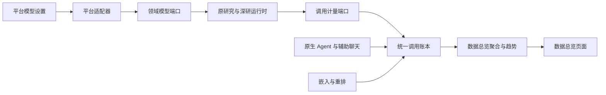

# 统一运行时与模型计量

## 模块边界

- `equipment_deep_research` 保留原研究任务、Agent 编排、深研、反馈与恢复协议；不得导入 `platform_core`、平台 HTTP 或 PostgreSQL 驱动。
- `providers/platform_access.py` 只声明宿主注入的模型解析、公开目录与调用观察端口。独立运行与 fake 测试无需平台宿主。
- `platform_core/services/equipment_model_adapter.py` 将平台模型配置映射为领域执行参数；`equipment_model_usage.py` 只转换领域计量事件。
- `platform_core/repositories/model_call_repository.py` 是模型调用账本的写入入口，持有 PostgreSQL 连接与幂等插入。原生 Agent、辅助聊天、嵌入、重排共同使用它，不依赖装备研究适配器。
- `DashboardRepository` 读取账本和历史汇总；Vue 只调用已有 dashboard API，不自行拼接统计来源。

## 执行约束

真实研究任务使用所选平台 `model_spec`；历史任务缺少标识时使用平台默认模型。API Key 仅执行时解析。平台任务不能被旧 `.env` 的全局模型、子 Agent 覆盖或备用供应商接管。

Chat Completions 保留原结构化输出合同，遵守调用方的超时与瞬时错误重试次数。有限时调用增加异步总时限，避免持续 SSE 心跳让调用无限等待；显式禁用超时的原报告步骤仍保留原语义。异步超时不代表供应商已经停止计算，可能仍产生供应商费用；没有最终 usage 的请求保持用量未知。

统计失败不会吞掉原模型结果或替换原错误。PostgreSQL 短暂故障由本地持久队列补写；这仍不是跨双存储、计费级零丢失承诺。

## 计量口径

`platform_model_calls` 只保存调用标识、模型标识、入口、运行标识、阶段、状态、耗时、供应商上报 token 和错误类型。不会保存 API Key、Base URL、研究正文、反馈正文或推理内容。

- 原研究 Chat Completions：每次实际请求独立记录，包含协议降级、重试、失败、取消。
- 原生 Agent：每次模型 handler 调用记录；内部 SDK 透明网络重试不单独拆分。
- 直接使用平台聊天模型的辅助功能：LangChain 回调计量。原生 Agent 调用期间抑制通用回调，避免双计数。
- 嵌入：每个 HTTP 批次及其重试计量；重排：每个 HTTP 批次计量。
- 原生与旧深研、Query 生成、研究任务、反馈自进化分别归类。只保存反馈的操作不调用模型，因此不会虚增模型调用量。
- 未返回 token 时字段为 NULL，仍计调用次数。Token 上报率以实际返回 token 的调用为分子；零 token 的有效上报属于已上报。
- 数据总览显示累计调用、已上报 token、运行次数、Token 上报率、失败调用、平均调用耗时；模型分布和时间趋势使用同一事实表。
- 新账本已覆盖的运行，不再叠加它的旧汇总；其余历史汇总保留。无法从未记录的历史响应还原 token。若上线前同一运行已有未入账的部分用量、上线后又继续运行，新账本不能自动重建此前部分。
- 账本按实际调用时间统计，平均耗时仅计算有逐次记录的调用。旧汇总没有逐次失败明细时页面显示“—”。
- 同地址、同密钥、同模型的多个配置别名无法仅凭旧运行时参数区分时，标为 `unattributed`，不猜测归属。

## 权威存储与部署

身份、权限、原生 AgentRun、模型配置和调用账本属于 PostgreSQL。原研究任务与旧 Query 队列目前仍使用各自 SQLite 仓储；没有通过影子任务重复运行同一研究，也没有宣称两种状态存储已经物理合库。

业务 schema 由 8 增至 9。`v074_model_calls.py` 仅新增表和索引；升级入口接受版本 8，保留原数据。迁移后同步重启 API、平台 Worker、equipment-worker、equipment-query-worker，避免领域源码哈希或已加载适配器版本不一致。

数据总览保持超级管理员访问权限。后台任务的模型调用可在业务终态之前入账；取消或删除研究记录不会自动删除模型计量事实。

## 验证与尚未完成的验收

2026-09-24：

- 反馈、隔离、审批、回滚、模型协议等专项回归 86 项通过。旧提示词测试改为临时包资源副本，避免改写运行中服务的提示词。
- 架构边界、模型预算、原生深研适配、计量、重排与迁移等 113 项单元测试通过。
- 真实 HTTP 模拟供应商 + PostgreSQL + dashboard API：8 次调用准确计为 8 次、60 token，包含 2 次失败；重复事件幂等，原生 Agent 与通用 callback 不重复，普通用户访问被拒绝，趋势与模型汇总一致。测试记录清理后不污染正式统计。
- 企业隔离与 fake 研究队列真实 HTTP 验收通过；前端 361 项单测、构建和修改组件定向 lint 通过。
- 平台原生 `/api/equipment/deep-thinking` 入口经 Nginx 的真实供应商验收通过：创建独立项目与会话、提交消息、Worker 完成、助手消息回写、所选模型与“深研对话”账本归类一致。本次简短民用维护问题耗时约 6.6 秒，测试身份、会话及工作区已清理。该结果不代表完整研究报告的耗时。
- 浏览器当前无已登录会话，新增页面指标未完成最终登录态视觉验收。
- DeepSeek/GLM 文本与工具真实调用成功。后续使用系统默认 `siliconflow-cn:deepseek-ai/DeepSeek-V4-Flash` 的真实 HTTP 验收中，Query 生成与旧深研会话均完成，并确认助手消息回写；总计 1248 秒。账本中一次调用耗时约 906 秒，因此不能据此宣称低延迟。该验收未覆盖完整动态研究任务、画像报告和反馈优化的全部真实闭环。MiniMax 仍有供应商 `403 Model disabled` 限制。

运行 `test/integration/api/test_model_usage_ledger_live.py` 只访问本地模拟模型，不产生外部模型费用。运行 `test_equipment_unified_models_live.py` 或 `test_native_deep_models_live.py` 必须显式设置 `EQUIPMENT_TEST_LIVE_MODELS=1`，会产生真实供应商调用。后者覆盖平台原生入口的请求、Worker、消息回写与计量归属，并在确认运行终态后清理专用测试用户及其工作区。

真实供应商验收默认观察 600 秒，可用 `EQUIPMENT_TEST_LIVE_TIMEOUT_SECONDS` 扩展观察窗口；测试输出阶段变化与耗时，不输出完整任务正文。观察时限到达且任务仍在运行不等同于供应商调用失败。

通用 Chat Completions 传输已修复 SSE 终止处理：收到独立 `data: [DONE]` 后立即关闭响应，不继续等网关断开；保留终止前的 usage，并不把正文中的 `[DONE]` 字符串当终态。本地真实 HTTP 保活测试通过；清除测试进程继承的旧 `EQUIPMENT_DR_*` 环境后，终止处理与 provider registry 共 39 项通过。这是独立复现的协议问题，尚未证明它是当前真实深研长时间运行的原因。

该传输修复部署后，同一默认模型与民用验收场景再次通过 Query 生成、旧深研完成和助手消息回写，总耗时 747 秒（约 12 分 27 秒）。此样本比前次 1248 秒短，但模型响应随机性与供应商负载未受控，不能将差异全部归因于修复或宣称固定加速比例。

后续权限复核发现：原生深研会话的全局列表可见，但详情错误地按管理员自身 UID 校验线程及筛选运行。已将详情、能力版本与分支历史的读取改为使用经授权的真实所有者；普通用户越权和线程错绑仍返回 404。真实 HTTP 已复现修复前的管理员 404。真实深研结束后已同步更新 API 与三个 Worker；部署后的原生会话权限、UTC 计量真实 HTTP 验收与服务单测共 14 项通过，readiness 正常。

调用账本时间统一为 UTC：修复 PostgreSQL `Asia/Shanghai` 会话下 `NOW()` 写入无时区字段导致的 8 小时偏移。新表默认值、已有表默认值及仓储 SQL 显式使用 UTC。当前环境原账本由同一旧 SQL 写入的 12 条记录，在锁表事务中按已核实的上海时区校正一次，并同步修改默认值；重复执行不会再次校正。真实 PostgreSQL＋HTTP 验收新增时间范围断言，确认全部调用时间位于请求开始与结束的 UTC 区间。

平台研究 Durable Task 的取消竞争已通过真实 PostgreSQL 复现：原实现把已取消任务被动改回完成。现由 Repository 行锁串行化生命周期修改与 Worker 回写，终态拒绝迟到的状态和事件；正常完成状态与产物引用同事务提交。已覆盖取消先提交、取消事务尚持锁、正常完成及重复回写。此保护不等同于立即停止已发出的供应商请求或强制终止 Python 工作线程，不能据此承诺取消瞬间停止计费。真实深研复验结束后已同步更新 API 与三个 Worker。部署后的取消 HTTP、PostgreSQL 竞争、管理员全局查看、计量与企业隔离等专项共 22 项通过，readiness 正常。

平台研究任务适配层已修复执行参数丢失：此前数据库保存了用户选择，调用 Runner 却落入默认模式。现在显式传递执行 profile、交互模式、分支、确认状态、报告模板及项目标识，并保持持久化记录一致。配置契约测试先复现失败、修复后通过；部署后的 `test_platform_research_delivery_live.py` 经真实 HTTP、队列和 Worker 使用 fake 模型约 2.3 秒完成，验证报告文件、产物索引、报告列表和授权文件读取。该验收验证软件交付链路，不验证真实模型研究质量，也不产生外部模型费用。

新增融合要求已完成：平台原生深研继续通过知识库工具与会话资源权限解析器访问 RAG；平台 Durable Task 与旧 `/api/v1/runs` → `equipment-worker` 动态蜂群链路复用同一平台知识检索端口，但不再在 Worker 启动或恢复时批量预检索。`knowledge_enabled` 只表示能力可用；`knowledge_ids=null`、显式 ID 列表和空列表分别表示全部当前可见库、受限候选范围和禁用范围。每次实际工具调用都按持久化 owner UID 重新解析授权，显式范围只能收窄；超级管理员代管不会扩大资源所有者的知识范围。

动态蜂群仅给 S6“装备与技术实现”的首次正式撰写轮次开放可选 `query_kb`。工具选择保持 `auto`：没有明确事实缺口时不产生任何知识检索；结果只作为调用 Agent 当前轮次的 `role=tool` 消息进入一次收敛回答，不进入 supplemental、共享上下文、winning payload、深研父上下文或其他 Agent。第二轮不再开放知识工具或 hosted search。未命中、资料有限、权限拒绝或服务失败时不重试、不裁剪候选、不限制模型发散，继续依靠已有证据和模型推演完成技术方案并标注不确定性。单次结果有正文上限，运行事件只记录知识库 ID、数量和失败摘要，不复制检索正文。

旧 Worker、知识适配、Durable Task 契约、S6 定向工具路由与统一模型组合均有专项回归。覆盖无工具调用的单轮完成、单知识库故障降级、授权撤销、fake 跳过、非 S6/repair/retry/recovery 禁用知识工具，以及独立领域运行未安装平台适配器时的兼容行为。

### 数据总览补充验收（2026-09-24）

- 继续复核直接模型调用，补齐 DeepSeek OCR 每次请求及 PaddleOCR 云端推理作业的计量；PaddleOCR 的状态轮询与结果下载不单独增加调用次数，未上报 Token 保持 NULL。OCR 统计包含作业结果获取耗时；这不是供应商 GPU 推理耗时。
- 修复重排返回 HTTP 200 但结果数量、索引或分数无效时误记成功的问题。维持原有批次降级行为，同时账本正确记录失败；若供应商已上报用量，失败调用仍保留该用量。
- 扩展真实 HTTP＋PostgreSQL＋数据总览验收：12 次请求对应 12 条记录、72 Token、3 次失败，覆盖同步/异步嵌入、重排无 usage、重排协议失败，并验证模型汇总、趋势、幂等去重及普通用户无权查看全局统计。
- 定向回归 127 项通过；PaddleOCR 另有 10 项通过。全部使用本地模拟供应商，不产生真实模型费用。账本 ORM 默认时间按数据库方言编译，PostgreSQL 明确 UTC，SQLite 测试使用原生 UTC 时间。
- 通用知识库检索抽取至 `knowledge_retrieval_service`，原生工具复用同一权限投影与检索管线；未授权检索在嵌入/重排之前拒绝。本次未将检索扩展到武器设计或作战方案生成链路。

统计范围为平台已接入的模型与上述 OCR 调用；远端第三方服务内部的隐藏模型调用无法逐次观测。模型目录查询、文件上传、轮询和仅保存反馈不是模型推理，不纳入调用次数。PostgreSQL 写入失败会进入本地持久队列，具体边界见下方“模型计量故障补写”。

本次补充已构建并同步部署 API、平台 Worker 与两个研究 Worker；readiness 返回 ready、degraded=false。部署后的真实 HTTP＋PostgreSQL＋总览闭环再次通过（约 2.8 秒），各服务运行正常。最终登录态页面视觉验收仍未完成。

### 登录态页面验收补充（2026-09-24）

浏览器现有会话已登录，已通过真实 UI 确认研究入口显示平台默认模型选择器，数据总览可访问，模型调用趋势可切换，统一用量卡片及分入口表格正常呈现。此结果更新此前“无登录态、未完成页面验收”的记录。未提交新的研究请求或触发历史武器研究任务。

历史运行无计量时，汇总中的 0 不能解释为实际零消耗。前端指标现标为“已记录调用”和“已上报 Token”，并说明上报率、失败数与平均耗时的统计范围，显示尚无 Token 上报的运行数。真实页面样本为 27 次调用、4,309,026 Token、16 次未上报历史运行；这些数值是当时快照，不作为固定验收期望值。部署后的截图确认说明完整显示。前端 361 项单元测试、生产镜像构建和修改组件 lint 通过；尚未覆盖所有主题与窄屏布局状态。

前端全量只读 `pnpm run lint:check` 同样通过；部署后 readiness 正常且无降级。

### 模型计量故障补写（2026-09-24）

模型调用现在先写入共享输出目录中的 SQLite 持久队列，再幂等写入 PostgreSQL 统一账本。PostgreSQL 短暂不可用时，调用结果不再只留下错误日志；后续模型调用以及超级管理员读取模型用量或模型/Token 趋势时会自动补写。调用 ID 是幂等键，重复恢复不会增加调用次数。数据总览增加“待同步调用”指标，便于发现积压。

本机制覆盖已进入平台计量观察器的调用。若本地持久卷与 PostgreSQL 同时不可用、磁盘损坏，或进程在本地事务提交前被强制终止，仍不能承诺零丢失。队列不保存正文、凭据或模型响应，只保存原账本已有的标识、状态、耗时和 Token 字段。

故障恢复单元测试 3 项及相关计量/总览回归共 29 项通过；部署后的真实 PostgreSQL 测试 2 项通过，覆盖临时写库失败、总览读取自动补写、重复事件不双计，以及原 12 次本地模拟供应商请求的汇总一致性。当前队列积压为 0，readiness 正常且无降级。
