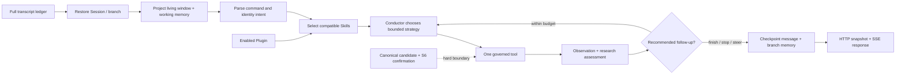

# nanobot 深研对话适配设计与实现

## 1. 适配目标与硬边界

本设计对照 `reference/nanobot-main` 的 `AgentLoop`、`AgentRunner`、Plugin/Skill registry、Memory/Session 和 WebUI 投影协议，目标是把深研对话从“每轮固定跑一条长流水线”改成“有界、可恢复、按观察继续决策的研究循环”。迁移的是职责边界和不变量，不是把通用个人助理的全部工具搬进装备研究系统。

深研对话必须同时满足以下边界：

1. **单装备身份锁是硬边界。** 一轮只研究当前 Query 下的一个源装备基线，并从该基线跃迁出新质装备；客户端提交的名称、证据、分数或卡片只是提示，不能自行创造候选身份。进入 S6 前，服务端必须从当前 run 的候选谱系解析出唯一的 canonical candidate，并将身份写入 Session context。
2. **S6 是显式用户确认后的状态转换。** 普通发散、追问、`/diverge`、`/challenge`、`/synthesize` 都不会自动成卡。只有用户显式成卡动作（`/card`、精确的独立确认语句，或 UI 确认后发送的 `create_artifact=true`），并且当前工作记忆中已有结构闭合的稳定方向，才可调用 `author_s6`。
3. **三席发散和对抗裁决保留为策略组件。** 开场、专家明确要求推翻/换方向、强争议或已有方向无法回答问题时，`research_council` 仍执行隔离并行提案、交叉挑战和综合。它不再是每轮追问的固定入口。
4. **证据门和发布质量门退出深研主循环。** 深研可以在证据稀疏、S6 栏位不完整或研究缺口仍存在时返回可见候选。`research_assessment`、`research_gaps` 和 `advisories` 记录缺口，兼容性的 `quality_gate` 也标记 `non_blocking=true` 且研究阶段 `block_reasons=[]`。真实的身份不一致、用户未确认、持久化失败、claim 丢失和取消仍可使任务停止或变为 `partial/failed`。
5. **研究输出停留在能力概念层。** 感知、电磁、信息和自主能力只能作为发现、突防、进入或命中的赋能，终点必须是直接物理毁伤和可观察任务失能；不输出制造参数、配方或具体操作步骤。

主链如下：



这里的 `research_assessment` 是研究导航信号，不是阻断器；`quality_gate` 保留只是为了兼容旧消费者。

## 2. 从 nanobot 迁移的核心设计

### 2.1 极简 Agent Loop：主链只编排，不吞并领域逻辑

nanobot 的关键经验不是“循环代码少”，而是把 RESTORE、BUILD、RUN、SAVE 和 DELIVER 分开，并让 runner 在每次工具调用后把 observation 回灌给下一次策略。这样可以在不重放全部历史的情况下恢复中断 turn，也能在用户 steering 到达时停止当前动作。

本项目的对应实现为：

- `src/equipment_deep_research/deep_runtime/loop.py`：规范化命令、注入单装备 identity block、读取 branch memory、先做 Skill 目录选择，再创建 `TurnState` 并组装公开结果。
- `deep_runtime/planner.py`：维护固定的 runtime action allowlist、命令优先级和身份/S6 约束；对模型返回的计划执行 `sanitize_plan` 与 `sanitize_next_action`。
- `deep_runtime/conductor.py`：仅在已有候选且没有显式命令时，让模型选择本轮最小充分研究动作；回退到确定性 heuristic，不接受模型新增工具名。
- `deep_runtime/runner.py`：执行 `policy -> one tool -> observation -> checkpoint`，在每个工具边界检查 stop、cancel、claim 和 durable steer；默认 turn/tool 预算均为 4，运行时上限为 12，避免无限 agent loop。
- `deep_runtime/tools.py`：把已有领域编排包装成受治理工具，并把 `research_strategy`、`research_assessment` 和 `research_gaps` 加到结果中。
- `api/app.py` 的 job worker：持有 durable claim、写消息/版本/working-memory，并在持久化边界复核 ownership；runtime runner 不直接拥有 repository。

可执行动作目前是八个粗粒度工具：

| 动作 | 用途 | 典型入口 |
|---|---|---|
| `research_council` | 隔离并行提案、交叉挑战、综合 | 开场、明确重开或强争议 |
| `deepen` | 以工作记忆为基线的内部多维发散和收敛 | 普通追问 |
| `diverge` | 集成式开放发散，扩展正交假设 | `/diverge` |
| `challenge` | 反例、最低成本反制、失效边界和修订 | `/challenge` 或 observation 推荐 |
| `synthesize` | 比较候选、保留冲突、生成研究前沿 | `/synthesize` 或 observation 推荐 |
| `inspect_memory` | 只读当前 branch 的决策记忆 | `/memory`、S6 前检查 |
| `author_s6` | 沿已确认方向写 S6 五栏能力画像 | `/card` + 稳定方向 |
| `help` | 展示可用命令 | `/help` |

Skill 的 `allowed_tools` 不会改变这份 allowlist，也不会注册新的 handler。它描述程序方法应在哪个领域工具边界内执行，是目录、Prompt 和审计元数据；权限仍由 planner、领域工具和 API 的身份/确认检查共同决定。

### 2.2 从固定流水线到动态研究策略

`conductor` 输出 `intent`、`tools`、`rationale`、`focus_candidate` 和 `focus_lens`。它可以在一次计划中提出至多两个研究动作，runner 逐个执行并读取 observation。结果中的 `research_assessment.recommended_action` 允许在预算内继续 `diverge -> challenge -> synthesize`，但命令边界、已有候选条件和 S6 硬边界会再次通过 `sanitize_next_action`。

策略选择规则如下：

| 场景 | 策略 | 是否固定三席 |
|---|---|---|
| 没有工作记忆/候选 | `research_council` | 是，作为开场的隔离探索组件 |
| 已有候选的普通追问 | `deepen` | 否；一次内部推理选择必要透镜 |
| 专家要求扩大解空间 | `diverge` | 否；集成式正交假设发散 |
| 候选需要压力测试 | `challenge` | 否；集中做反例与反制审计 |
| 多轮结果需要比较 | `synthesize` | 否；形成前沿和下一问题 |
| 专家说“推翻/重开/换方向” | `research_council` | 是，重新建立隔离提案 |
| 用户明确成卡 | `inspect_memory -> author_s6` | 跳过发散和裁决 |

`deepen` 不是单点字段修补：Prompt 要求先沿内部维度和互斥角度交叉发散，再围绕专家问题收敛，最多外抛三个正交方向。`research_council` 保留三席和对抗裁决，但每席内部现在使用三分支发散矩阵：`assumption_inversion` 改写传统任务链假设，`mechanism_mutation` 改写构型或直接作用机理，`boundary_inversion` 把对手反制与极端边界变成设计入口。每席最多保留三个带 `branch_id`、`novelty_delta`、`counterfactual_test` 和 `research_probe` 的候选，裁决器优先保留不同席位和不同分支的正交方向；因此三席是稳定的责任边界，候选空间可以扩大到九个可审议分支，而且每个方向都携带下一轮应验证的研究问题，而不是把三席误解为三个固定答案。它仍是可调用的 topology，而非每轮仪式。

### 2.3 Observation、checkpoint 与 steering

每次工具调用都会保存有限的 observation：工具名、轮次、状态、公开结果投影或错误类型。checkpoint 使用 `deep-runtime-checkpoint-v1`，只保存恢复所需的 plan、已完成工具、active Skill、pending tool call、公开结果字段和 stop reason，并有 60,000 字符上限。不会把 provider 原始响应、隐藏思维链或父任务完整证据写进 checkpoint。

`should_stop`/host stop callback 用于取消和 claim 失效；steer callback 在工具前后领取 `steer`、`interrupt_steer`、`interrupt_send`。`interrupt_send` 会保留已提交阶段成果并终止当前 runner，后续消息在同一 Session/branch 继续。失败、取消或 claim 丢失时，不把未提交答案推进为新的 working-memory checkpoint。

### 2.4 Channel、Provider 和轻量 Subagent 边界

这次适配把 nanobot 的入口和模型边界也抽出来，但不把渠道逻辑塞进研究编排：

- `deep_runtime/channel.py` 定义 `InboundMessage`、`OutboundMessage` 和 `MessageBus`。默认 Bus 是 job-local asyncio queue；部署宿主也可以注入 `DurableMessageBus`，由 `SqlMessageBusStore` 提供跨进程、短 lease、owner fencing 和崩溃恢复。Web、CLI、WebSocket 或未来的聊天连接器只负责把消息放入 inbound queue，再从 outbound queue 取结果；消息带稳定的 `channel:chat_id` session key。入口会递归裁剪 metadata/payload，并对 authorization、token、cookie、private key、raw provider response 等字段脱敏。Bus 不持有 Session、Provider 凭据或领域 repository。
- `deep_runtime/gateways.py` 提供 Telegram/Discord 的薄适配器与 `VerifiedChannelGateway`：对 webhook raw body 执行 HMAC/replay 校验，解析平台事件，执行 sender/chat allowlist 与 bot/webhook 回环抑制，由可信宿主解析 Session key，再走同一 MessageBus/Agent Core；出站只生成不含凭据的 `sendMessage`/create-message 请求体，并按平台长度限制分片。它不连接平台网络，也不读取 token。
- `deep_runtime/loop.py::run_deep_research_message` 是 channel 到 Agent Core 的适配器；它接受 `query`、`active_skill_ids`、研究 focus/mode 和子 Agent opt-in 等显式研究提示，并把 runtime 结果包装成同一路由的 `OutboundMessage`。可信 host payload 优先；canonical 身份、Session/branch、working memory、S6 授权、预算、workspace 和进程内依赖不从 channel payload 读取。HTTP API 仍可直接调用 `run_deep_research_turn`；MessageBus 既可作为共享入口，也可由宿主显式接入 durable broker。
- `deep_runtime/provider_runtime.py::ProviderRuntime` 是统一 Provider facade。它接收 `ProviderRequest`，支持 `complete`/`complete_json`/streaming、能力快照、取消和 host 的旧 `_run_core_json` callback；底层可以是 Responses、Chat Completions、Codex CLI、本地模型或 fake provider。`snapshot()` 只输出 allowlist 字段和 base URL host，不输出密钥、原始响应或隐藏 reasoning。
- `deep_runtime/subagents.py::LightweightSubagentRunner` 只在显式 `/diverge` 或 payload opt-in 时按需执行最多 2 个正交 probe，使用同一 ProviderRuntime，返回 `finding/assumptions/next_probe` 等可合并结果。它没有独立 Session、工具权限或第二套编排图；主 Agent 仍负责身份、裁决、记忆和 S6 gate。
- `deep_runtime/tool_registry.py::ToolRegistry` 是 Agent Core 与领域 handler/MCP adapter 之间的统一注册边界。内置八个动作通过 registry 执行；`DeclarationOnlyMCPAdapter` 只登记声明和生命周期状态，默认不启动进程或网络，只有显式 `InProcessMCPAdapter` 才能在受控测试/本地场景提供工具。allowlist、namespace、数量限制和卸载在 registry 层统一执行。

对应验证位于 `tests/equipment_deep_research/unit/test_deep_runtime_boundaries.py`、`test_deep_tool_registry.py` 和 `test_deep_runtime.py`；它们覆盖 bus 脱敏/队列确认、Provider snapshot/旧 callback、轻量子 Agent 合并和 registry 的 declaration-only/allowlist 行为。

`GET /api/v1/deep-thinking/capabilities` 的静态 `runtime_contract` 公开主链动作、预算上限、身份/S6 硬边界和 Channel/Provider/Subagent/Memory 的职责来源。它说明可执行条件，不代表当前已连接某个 Provider 或已启动 MCP；具体工具状态由 `tool_registry` 给出。

## 3. Plugin 与 Skill：可安装能力和程序性知识

### 3.1 Plugin 是安装、授权和失效边界

兼容的包形状为：

```text
plugin-root/
├── plugin.json
├── skills.yaml 或 skills/<skill-id>/SKILL.md
└── mcp.json
```

发现不等于授权。第三方 Plugin 初始关闭；管理员启用时，状态绑定规范化安装根和完整包 SHA-256 指纹。启停状态写入共享的 `outputs/runtime/deep-plugins.json`，使用进程锁、临时文件、`fsync` 和原子替换。当前状态是 deployment-global，不代表 tenant、workspace、project 或 Session 级隔离；多租户部署必须继续由管理员角色保护 PATCH，或另建隔离 registry/状态文件。

`capabilities.py` 用 no-follow 文件描述符建立单次有界 `_PackageSnapshot`，同一份文件字节和目录清单同时用于解析和指纹；启用包再做一次快照，变化即 fail closed。拒绝符号链接和特殊文件，限制 512 文件、256 目录、单文件 2 MiB、总量 16 MiB、深度 12。Plugin 不能覆盖同名内置 Skill、添加核心 runtime 动作、放宽单装备/S6 约束或注入发布权限。公共目录只暴露名称、权限声明、Skill ID、MCP server ID、transport 和 enabled 状态，不暴露本地路径、命令、参数、工作目录或环境值。

### 3.2 Skill 是程序性知识，不是长 Prompt

可运行 Skill 必须具备可执行合同：

- `triggers` 和适用的 runtime action；
- 有序 `steps`；
- `required_artifacts`；
- `quality_gates`（方法检查/质量提示，不等同于深研阻断门）；
- `stop_conditions`；
- 可选 `SKILL.md` instructions 与 `scripts/references/assets` 资源索引。

缺少步骤、必需产物、质量门或停止条件的 Plugin Skill 不进入 registry。依赖可从直接 `requires` 或 `metadata.nanobot.requires`/`metadata.openclaw.requires` 读取；缺少 CLI 或环境变量时仅标记 unavailable，不把秘密值写入日志或 Prompt。

每轮最多激活 6 个 Skill，选择顺序为：服务端验证的 `active_skill_ids`、文本中的 `$skill-id`、Plugin trigger/适用动作和内置 action 默认 Skill。只把已选 Skill 的步骤、合同和正文渐进加载到当前 Prompt；下一轮重新选择，不把全部 Skill 目录塞进 Context。`allowed_tools` 是方法声明，不能授予执行权限。

### 3.3 MCP 声明与受控研究观察

`mcp.json` 可被发现、展示和审计，默认 `execution_status=declaration_only`，声明不会启动 transport。可信宿主可建立 `ToolRegistry`，显式调用 `attach_mcp_adapter(server_id, adapter, allowed_tools=[...])`，再通过进程内 `tool_registry` 依赖注入深研 turn；HTTP 和 Channel 消息不能挂载执行对象。核心八动作会重新注册，外部包不能替换身份或 S6 handler。

`research_support.py` 只把已挂载且 ready 的 namespaced MCP 支持工具交给模型选择。每轮至多两次支持调用，计入同一 `max_tool_calls`，并至少为领域动作保留一次调用；`help`、`inspect_memory` 和 `author_s6` 不触发支持调用。选择和调用分别有 15 秒超时，支持错误为 advisory，取消会传播。工具观察经过有界脱敏后进入领域模型和 checkpoint，明确标记为待核实外部数据，不能授权成卡或改变身份。

宿主拥有 adapter 生命周期、参数 schema 验证和 transport 隔离。自动研究 allowlist 应只包含适合自动调用的查询与研究支持工具。仓库没有默认网络/stdio transport，也不会执行 Plugin 声明中的命令；真实 transport 仍需宿主独立实现。

## 4. Memory 与 Session：完整账本和有界上下文

### 4.1 两层记忆

持久化 Session 保存完整、按序、分支感知的 user/assistant 消息、artifact refs、version refs 和公开 metadata；压缩只影响模型窗口，不删除 transcript。模型上下文默认保留当前 branch 最近两轮 user turn（living window），并投影有界 working memory。当前 context budget 约 12,000 字符，`conversation_context_usage` 返回 living/archived turns、估算占用和计数。

每个 branch 有独立 checkpoint。引用追问只把选中的摘录转成用户约束，不把整段历史重新注入；`source_checkpoint` 绑定 assistant message id、sequence 和 answer fingerprint，恢复时可判断记忆是否来自已提交答案。fork 只能继承 fork 点可见的 checkpoint，不读取兄弟分支的新记忆。

### 4.2 Working-memory schema

除目标、用户约束、候选方向、决策、淘汰方向、最近摘要、开放问题、激活 Skill 和最后工具计划外，当前研究投影新增：

| 字段 | 形状 | 下一轮作用 |
|---|---|---|
| `research_iteration` | 整数 | branch 内研究轮次 |
| `research_frontier` | 最多 8 行：`direction/status/why_promising/assumption/next_probe` | 记录当前最有信息增益的方向和下一探针 |
| `assumption_ledger` | 最多 12 行：`assumption/direction/status/rationale` | 记录保留、开放或被改变的关键假设 |
| `explored_lenses` | 最多 18 个短字符串 | 防止每轮重复同一维度，帮助 conductor 选择新透镜 |
| `research_gaps` | 最多 10 个短问题/缺口 | 把不完整性变成下一轮研究任务，不阻断当前回答 |
| `last_research_strategy` | `mode/rationale/actions/lenses` | 告诉下一轮上一次采用了何种 topology |

`working_memory_prompt()` 只允许白名单字段；`projectDeepMemory` 在 WebUI 中进一步裁剪为候选、前沿、假设、透镜、缺口和策略。这样 Memory 是“可行动的研究状态”，不是未经筛选的历史转储。

### 4.3 Session、Job、Branch 和 runtime checkpoint 的关系

- Session：用户可见消息和分支容器。
- Branch：独立消息 ancestry 与 working-memory checkpoint。
- Job：一次异步 turn 的 claim、stage、progress、state version 和终态。
- Runtime checkpoint：runner 中途的恢复投影，落在 job/消息提交边界之外。
- Artifact/Capability version：只有显式 S6 路径才可能生成；研究草稿和部分持久化结果有明确 `partial`/pending 状态。

API worker 在写 user message、assistant message、working memory、artifact 或 version 前复核 claim；深研服务异常时可保留可见分析并返回 `partial`，但不能伪造完整持久化成功。

### 4.4 Workspace 与 Dream：可复制的外部状态空间

SQL ledger 记录 API 的并发、claim 和查询索引；nanobot 风格的外部工作空间记录可迁移的研究状态。实现位于 `deep_runtime/workspace.py`：

```text
<run-or-project>/.deep_research/
├── manifest.json       # schema、workspace_id、canonical identity fingerprint
├── config/             # workspace-scoped configuration and Dream prompt
├── skills/             # installed procedural knowledge resources
├── plugins/            # installed capability packages
├── sessions/*.jsonl    # complete transcript, metadata, message and checkpoint records
├── memory/
│   ├── history.jsonl   # append-only semantic journal with monotonic cursor
│   ├── MEMORY.md       # managed long-term memory, preserving analyst notes
│   ├── facts.jsonl     # deduplicated Dream facts
│   ├── dream-log.jsonl # consolidation audit records
│   └── branches/       # branch-scoped working-memory checkpoints
├── checkpoints/        # bounded runtime recovery snapshots
└── artifacts/          # task outputs and exports
```

`DeepWorkspace.open()` creates this layout and binds it to one workspace/equipment identity. Existing `RunWorkspace.deep_workspace()` uses the authenticated run file descriptor (`dup_run_fd()` + `path_from_fd()`), so a renamed run cannot silently bind the file store to a replacement path. Manifest identity or namespace mismatch fails closed. Resource names are relative and bounded; writes use same-directory atomic replacement and reject symlink state/resource directories.

HTTP 默认使用 `equipment_scoped=true`，每件 canonical 装备对应 `<run>/.deep_research/equipment/<identity-digest>/` 中独立的上述布局。一个任务可持续研究多件装备，彼此的配置、Session、Dream 和产物不会互相覆盖。与当前装备和 run namespace 一致的旧 `.deep_research/manifest.json` 会继续复用，已有笔记和记录无需迁移；其他装备建立新的独立目录。POSIX 上 journal 和 checkpoint 写入采用可重入文件锁，不同进程内的 workspace 实例共享锁文件，避免重复分配 cursor。

`DeepSessionStore` keeps the full transcript and branch checkpoints in JSONL. `build_context()` projects only the living window, selected branch working memory, and a bounded long-term memory excerpt, while exposing `transcript_count` and `context_usage` for UI diagnostics. The complete transcript is never replaced by compaction.

`DeepMemoryStore` follows nanobot's `MemoryStore`/Dream split:

1. `append_history()` records a bounded semantic journal entry and advances a monotonic cursor.
2. `build_dream_prompt()` returns only entries after `.dream_cursor`, together with a prompt that asks for durable facts, assumptions, decisions and open frontiers while excluding secrets/hidden reasoning.
3. `consolidate_dream()` accepts structured model facts plus the current working-memory projection, deduplicates them into `facts.jsonl`, atomically updates the managed block in `MEMORY.md`, writes `dream-log.jsonl`, and advances `.dream_cursor` only after the writes succeed. Manual analyst text outside the managed block is preserved.

`deep_runtime/memory_runtime.py` 将这些存储操作接入真实研究主链：

- restore 时只恢复两轮 living window 和目标分支 checkpoint；host 已显式提供的 SQL working memory（包括空对象）优先，文件状态不会覆盖它。
- 长期 Prompt 仅包含当前 Session/branch 的 scoped findings 和装备级手工笔记；兄弟分支的自动 Dream 假设不会进入当前窗口。`/memory` 同样使用该范围投影。
- 两轮研究通常产生六条 journal 记录，后续研究轮次使用同一 ProviderRuntime 做一次有 20 秒超时的增量 Dream；每批最多十六条日志。整理旧记录后再保存本轮，取消整理不会提前写入本轮 transcript/checkpoint。
- 每条模型 finding 必须绑定批次中出现的 Session/branch，保持假设与未验证状态；无效输出、超时或整理错误只产生 deferred 状态，不阻断可见研究，也不推进 cursor。
- Dream commit 使用模型实际读取的 `DreamBatch`。模型等待期间的新日志留给下一批；被其他整理器抢先提交的旧批次拒绝写入。
- 当前轮保留原始用户命令、可见摘要和完整有界结构化结果；working-memory source checkpoint 绑定文件中的 assistant message ID/sequence。SQL 仍是 HTTP 的完整消息、取消和失败记录权威账本。

对应多轮、分支、取消、无效输出、批次竞态和并发 cursor 验证位于 `tests/equipment_deep_research/unit/test_deep_memory_runtime.py`。

HTTP deep-dialogue jobs mount this state automatically from the server-owned `RunWorkspace.open_existing(output_root, run_id)` descriptor after resolving the canonical equipment candidate. The client cannot choose a filesystem path. The in-process adapter passes only the `DeepWorkspace` handle, session/branch identifiers and a small canonical identity projection; the loop removes the handle before planning/model payload construction, records the complete transcript plus branch working memory, and closes the run descriptor in `finally`. Historical artifact-only runs use a bounded direct-child fallback. A standalone runtime caller may still explicitly inject `workspace_path` for local tooling, but that path is never accepted from the HTTP request. Public result projection exposes only `workspace_id`, the relative `.deep_research` state location, cursors and a bounded status, never the worker's absolute path.

## 5. 研究结果与非阻断评估契约

所有研究工具都可返回 `concept_directions`、`visible_summary`、`divergence_steps`、`agent_dialogue`、`adjudication` 和 `open_questions`。同时附加：

```json
{
  "research_strategy": {
    "mode": "deepen|diverge|challenge|synthesize|research_council|author_s6",
    "topology": "...",
    "actions": ["deepen"],
    "rationale": "...",
    "lenses": ["..."],
    "fixed_pipeline": false,
    "s6_requires_confirmation": true
  },
  "research_assessment": {
    "advisory_only": true,
    "non_blocking": true,
    "research_complete": true,
    "completion_semantics": "本轮有可继续研究的结果，不代表所有缺口已关闭",
    "status": "completed",
    "direction_ready": true,
    "candidate_count": 2,
    "research_ready_count": 1,
    "average_completeness": 0.72,
    "missing_s6_columns": [],
    "dimension_coverage": {},
    "candidate_reviews": [],
    "diversity": {},
    "unresolved_gap_count": 2,
    "recommended_action": "challenge",
    "recommendation_scope": "next_turn",
    "gaps": ["..."],
    "advisories": ["..."]
  },
  "research_gaps": ["..."]
}
```

`research_complete` 的含义是“本轮形成可继续研究的候选或完成只读动作”，不是“证据齐全、发布合格或所有 S6 栏位齐全”。研究阶段的旧 `quality_gate` 只在 runtime/domain 结果中保留兼容形状，`block_reasons=[]`、`non_blocking=true`；API 公共投影将其归一为 `research_assessment` 和 `research_gaps`，前端不得把缺口渲染成任务失败。runner 内部可读取 `recommended_action` 继续下一工具，HTTP 公共结果不承诺暴露该内部路由字段。

S6 路径仍有两个硬条件：服务端 canonical candidate/单装备身份必须存在，且请求必须带有用户显式成卡动作。确认后即使五栏有缺失或内容质量建议，也以 `candidate_ready`/草稿形式保留，缺失栏目进入 `research_gaps`；只有真实 ledger、claim 或 worker 故障才降级为 `partial/failed`。

## 6. WebUI 设计：让动态研究过程可读、可接管、可恢复

### 6.1 视图分层

当前 `DeepThinkingPanel` 将 nanobot WebUI 的 session projection、live event timeline 和 capability controls 组合成一个深研工作台：

- **会话历史与 URL 恢复**：按 Query 分组显示 Session；`run_id/session_id/branch_id/target` 写入 URL，刷新、前进/后退和引用目标都能回到同一工作现场。
- **阶段条**：`研究边界 -> 开放探索 -> 交叉复核 -> 方向深化 -> 形成画像` 是可见阶段，不代表每轮都经过全部阶段；动态策略可以只出现其中一部分。
- **动态参与者 roster**：从 `deep_agent_started/progress/handoff/completed/failed` 事件投影当前参与者、角色、轴、交付候选和状态。普通 `deepen` 显示内部多透镜角色；`research_council` 显示隔离提案席与对抗裁决；`challenge/synthesize` 显示对应策略角色；`/memory` 和 `/help` 显示只读参与者。UI 不硬编码“永远三席”。
- **研究过程控制台**：显示单调 progress、当前 tool、active Skill、已回传候选数、阶段事件和可重试状态；不显示隐藏推理链。
- **创新议事看板**：呈现可见轴、候选 chip、裁决/修订摘要、先机与制衡主张，并允许点击候选生成引用追问。
- **Memory 抽屉**：显示当前 branch 的目标、约束、候选、决策、研究前沿、改变的假设、已探索透镜、研究缺口和最近策略；同时显示 context occupancy（living/archived、frontier/assumption/lens/gap 计数）。
- **能力抽屉**：展示 Skill 的步骤合同、依赖、Plugin enabled 状态以及 MCP `declaration_only`；用户可选择最多 6 个 active Skill。
- **命令和接管**：提供 `/diverge`、`/challenge`、`/synthesize`、`/memory`、`/help` 和 `/card`；支持 `steer`、`interrupt_steer`、`interrupt_send`、取消、重试、归档、分支和引用追问。

### 6.2 SSE 与快照一致性

HTTP Session/Job 快照是重连后的权威校准面，SSE 是增量时间线。深研事件通过 `Last-Event-ID` 续流；前端合并时遵守：

- `state_version` 只能前进；旧版本事件丢弃；
- stage 使用固定顺序归并，不能从终态回退到旧阶段；
- progress 单调取最大值；
- terminal job 不能被旧轮询复活，只有更高版本的显式 retry 才能重新排队；
- event payload 只保留公开 summary、delta、refs、stage、status 和 bounded metadata。

因此断线、浏览器刷新和 worker 重启不会把已完成的研究伪装成重新开始，也不会丢失已提交的 branch memory。

## 7. API 公开契约

主要入口包括：

- `GET /api/v1/deep-thinking/capabilities`：Skill、Plugin、MCP 声明和 `limits.max_active_skills`。
- `PATCH /api/v1/deep-thinking/plugins/{plugin_id}`：仅 admin 显式启停 Plugin；重新发现包并校验指纹。
- `GET/POST /api/v1/runs/{run_id}/deep-thinking/sessions`：读取/创建 Session；创建时服务端解析 canonical candidate，并验证 `active_skill_ids`。
- `GET/PATCH/DELETE /api/v1/runs/{run_id}/deep-thinking/sessions/{session_id}`：读取、更新、归档/删除 Session 的公开投影。
- `POST .../sessions/{session_id}/messages`：异步追加问题，携带 branch、focus、`create_artifact` 和 active Skill；重启恢复使用 durable job payload。
- `GET .../sessions/{session_id}/events`：SSE replay/续流；`Last-Event-ID` 与 `state_version` 生效。
- `POST .../sessions/{session_id}/branches`：从已见消息和 checkpoint 建立分支。
- `POST .../jobs/{job_id}/steers`、`DELETE .../steers/{steer_id}`：持久 steering 与取消。
- `POST .../sessions/{session_id}/merge`：仅对服务端解析的候选执行后续合并，不接受浏览器伪造卡片。

公共 Session 快照包含 messages、artifacts、branches、working_memory、`active_skill_ids` 和 `context_usage`；工作记忆中的五组研究字段经过 bounded projection 后可供 Memory 抽屉使用。公共 job/event 投影不会暴露 provider credentials、原始命令、环境变量值或隐藏 reasoning。

## 8. 安全与治理不变量

- canonical candidate 必须来自当前 run 的 server-owned lineage；显式 hypothesis/card binding 不匹配时拒绝，客户端只提供 advisory context。
- 单装备 identity block 注入每一轮；Plugin、Skill、MCP 和 conductor 都不能跨装备或改变 Query 归属。
- `/card` 不是普通关键词命中：命令或确认语句必须独立成立，且必须有 coherent stable direction；否则留在研究阶段。
- evidence index 可以作为研究上下文和可追溯引用，但缺证据不会阻止发散；发布/文案质量发现进入 `research_gaps`。
- durable job claim、取消和 steering 在关键写入前复核；ledger 故障不得静默回退到过时的内存成功态。
- Plugin 快照拒绝 symlink/特殊文件并执行目录、文件、字节和深度配额；启用状态绑定根目录和指纹。
- Skill 的方法合同不会变成 runtime 权限；MCP `declaration_only` 不会启动进程。
- 日志、SSE、checkpoint 和公共 API 只保存 bounded public projection，不保存隐藏思维链。

## 9. nanobot 对照与取舍

| nanobot 参考 | 迁移内容 | 深研中的边界化实现 |
|---|---|---|
| `nanobot/agent/loop.py` | Turn Context、restore/build/run/save/deliver 分层 | `deep_runtime/loop.py` + API worker；领域身份和持久化 claim 留在 API |
| `nanobot/agent/runner.py` | 单工具调用、observation 回灌、injection、runtime checkpoint | 有界八动作；每次只执行一个工具；最多 4 turn/4 tool（上限 12） |
| `nanobot/agent/plugins.py` | manifest、启用状态、包能力边界 | no-follow snapshot、指纹二次校验、deployment-global 状态、MCP 默认声明与显式宿主挂载 |
| `nanobot/agent/skills.py` | 轻量目录、命中后渐进加载、requires 检查 | Skill 还必须有 steps/artifacts/gates/stops；每轮最多 6 个；不授予工具权限 |
| `nanobot/agent/memory.py` | 原始历史、摘要/长期记忆、consolidation 分层 | 完整 transcript + branch working memory + living window；新增研究前沿/假设/透镜/缺口/策略 |
| `nanobot/session/manager.py` | Session、branch、summary 和 in-flight checkpoint 分离 | SQL deep sessions/messages/branches/jobs；source checkpoint 绑定已提交 assistant |
| `nanobot/webui/*` | 会话投影、命令菜单、事件回放和能力面板 | 动态参与者/阶段、Memory 抽屉、候选引用、单调 SSE 合并 |

本项目复用并适配了 nanobot 的可恢复 loop、程序性 Skill、Plugin 能力边界、分层上下文、增量 Dream 和公开 UI 协议。通用自由工具和插件脚本执行仍不默认开放；MCP 通过显式宿主 allowlist 提供研究观察，长期记忆通过有界投影进入单装备问题。

## 10. 验证与后续边界

应持续验证：

- 普通追问不会机械重开三席；`/diverge`、`/challenge`、`/synthesize` 路由和 observation 推荐动作能在预算内衔接；
- `/card` 无明确确认、无 canonical candidate 或无稳定方向时不会成卡；确认后的 S6 缺口只产生 advisory；
- 五组 research memory 字段跨 turn、branch、重启和 SSE 恢复保持有界且不污染兄弟分支；
- Skill 依赖/渐进加载、Plugin 指纹竞态、资源 containment、公共 API 脱敏和 MCP declaration-only；
- SSE 旧事件不能覆盖新终态，真实 ledger/claim 故障仍返回 partial/failed；
- 前端动态 roster、阶段条、Memory 抽屉和研究缺口提示与公开字段一致。

真实 MCP transport 的命令、参数、endpoint、秘密引用和 allowlist 现由部署级 `mcp-host` 文件控制；Web lifespan 负责连接池关闭，配置在下一轮按内容指纹热重载，旧任务释放租约后才回收旧连接代。默认 Plugin 声明保持 `declaration_only`；只有部署宿主挂载的 allowlisted 支持工具可为五种研究动作提供观察，S6 授权仍走原有主链。仍需补充操作系统级子进程资源配额和生产 transport 审计。

## 11. 来源与许可

参考实现来自 `reference/nanobot-main`。复用与改写遵循其 MIT License；来源、版权和完整许可正文见仓库根目录 `THIRD_PARTY_NOTICES.md`。

## 12. 当前适配审计与剩余工作

以下是当前代码接入状态，不能以一个接口或一组 fake-provider 测试代替全系统完成证明。

| 用户目标 | 当前证据 | 仍需完成或验证 |
|---|---|---|
| 极简 Agent Loop | planner/conductor、runner、domain handlers 和 observation checkpoint 分层；Web 真实 Provider 轮次可在首个领域动作后读取观察并有界选择一次不同的 follow-up 或 finish | 用真实模型 benchmark 深度、重复率、时延和调用成本，继续改进策略而不增加固定流水线 |
| 能力与智能解耦 | ToolRegistry、capability registry、Provider facade 独立；Web 部署入口可挂载共享 MCP，核心只见每轮 Registry 租约 | 增加更多生产能力 adapter 与故障演练 |
| 模块化 Skill | 已启用 Plugin 与 Workspace Skill 渐进加载，步骤/产物/质量建议/停止合同独立；装备范围目录与 Web 选择已贯通 | 持续扩充和评测方法包；新会话创建前的目录仍为部署目录 |
| Session / Memory | living window、branch checkpoint、自动 scoped Dream、旧批次拒绝、取消和无效输出有真实多轮测试；Dream 以 subject/stance 分别保留同一议题的支持、挑战与不确定判断 | 用真实模型检查长期记录的去重、冲突提取准确率和信息增益 |
| Workspace | 按装备独立状态目录、旧目录复用、原始命令/结构化结果、文件锁、Skill/Plugin 发现与研究配置投影已接入；装备插件独立启停；Web 能力抽屉可读写装备范围 `config/skill/plugin` 文本资源，提供 Skill/Plugin/Config 模板、结构化合同校验并刷新能力目录；资源写入已有版本历史、`expected_sha256` 乐观冲突保护、历史恢复和可回放历史摘要；Plugin manifest、Skill、MCP 声明和删除项支持三方包级预览，并在管理员确认后于 Workspace 锁内原子提交，失败时文件与历史日志一并回滚；Web 已提供包级文件编辑、预览和管理员提交入口 | 继续补充生产协作审计与跨进程 crash recovery 细化 |
| Channel 解耦 | Web worker 默认通过 job-local MessageBus 分发；宿主可注入 `SqlMessageBusStore` 作为跨进程 durable broker；CLI 复用同一服务端 Session/worker；Telegram/Discord 事件适配、allowlist、HMAC/replay 验证、可信 Session 绑定、对象式 verified gateway、出站分片和可选 `SqlGatewayDeliveryStore` 持久幂等复用同一核心入口 | 部署层仍需配置平台 token/webhook 或 bot 长连接，并把外部 chat 映射到已授权的 run/Session；durable broker 是可选 host-owned 能力，默认不会改变 job-local 语义 |
| MCP 基础设施 | namespace、allowlist、受控观察、每回合调用预算、并发、超时与取消；标准 SDK stdio/Streamable HTTP；Web lifespan、跨 job 复用、配置热重载、旧连接代延迟回收和有界重连退避均有测试 | 补充子进程资源配额和生产 transport 审计；Plugin 声明继续不自动启动 |
| Provider 抽象 | injected Provider 驱动 conductor、领域工具与轻量 probes；structured JSON/stream/snapshot 已覆盖 | 真实部署 Provider 切换与输出兼容性仍需端到端确认 |
| 轻量 Subagent | 有限任务/并发、隔离身份上下文、可合并发现和错误排除有测试；Web 的显式 `/diverge` 自动触发两个正交 probe，普通追问不常驻多 Agent | 如需面向用户的精细控制，可增加 Web 开关与任务预览；继续用真实模型评估 probe 增益 |

单装备身份锁、显式 S6 确认和 durable ownership 保持为执行边界；证据和发布质量检查为 advisory。上述剩余工作继续属于原始全方位适配目标。

### 12.1 Workspace 能力发现与配置

每轮在部署能力快照上叠加当前装备 Workspace，不修改全局 Registry 或其他装备。

- `skills/<name>/SKILL.md` 使用 YAML frontmatter 与 `procedure` 合同；`name` 必须与目录一致；Skill ID 为 `workspace:<name>`，支持显式选择、触发词和动作匹配。只加载选中 Skill 的正文与资源索引，不执行其脚本。
- `plugins/<package>/` 使用现有 Agent Plugin manifest 和步骤合同。`config/plugins.json` 保存根目录/内容指纹绑定的启用状态；同名部署 Plugin 优先，Workspace 包不能替换全局启用内容。
- `config/runtime.json` 只投影 `active_skill_ids`、`disabled_skill_ids` 和 `deep_runtime_budget.{max_turns,max_tool_calls}`。预算上限为 12，宿主字段逐项优先；显式空 Skill 列表保留为用户选择。身份、S6、Provider、可执行工具和 MCP 挂载不可通过文件授权。
- 文件内容按现有 no-follow 快照与配额读取；软链接、特殊文件、超额包和不完整程序合同不参与研究。公共目录不包含本地根目录、指纹或环境变量值。
- `GET /api/v1/runs/{run_id}/deep-thinking/sessions/{session_id}/capabilities` 返回经 Session 范围鉴权的装备目录；消息提交使用同一范围校验所选 Skill。Web 在恢复会话后读取该目录。
- `PATCH .../sessions/{session_id}/plugins/{plugin_id}` 仅允许 admin 在装备范围启停本地 Plugin；部署插件继续使用原全局入口。修改包内容会使原指纹授权失效。

新建未绑定会话时 Web 仍使用部署目录，绑定 canonical 装备会话后叠加装备 Workspace。能力抽屉的“装备工作区”通过服务端资源 API 列出、读取、保存、删除和恢复 `config`、`skill`、`plugin` 资源；浏览器不能提交 filesystem path，写入/删除/恢复要求 admin 角色和 `Idempotency-Key`，服务端根据当前 Session 的 canonical candidate 打开可信 workspace。Web 现在提供遵循真实解析器 schema 的 Skill、Plugin 清单和 runtime 配置模板，保存后重新发现能力；Plugin 仍默认停用，MCP 声明不会因为编辑而自动执行。每次真实内容变更会在装备目录下保存有界历史快照；读取返回 `version_id`、`sha256` 和历史摘要，保存与恢复可携带 `expected_sha256`，若其他研究者已写入则返回 409 与当前 ETag，避免静默覆盖。新增的 `POST .../workspace/resources/{kind}/{path}/merge` 以历史版本为 base、当前文件为 ours、编辑器草稿为 theirs 生成三方预览；无重叠改动自动合并，重叠改动返回标准冲突标记，预览不直接写盘，用户确认后仍走原有保存与锁校验。Plugin 目录另有 package merge preview 与 admin-only apply 接口，会同时检查 manifest、Skill、MCP 声明和删除项并返回 `atomic_ready`；apply 在 Workspace 锁内重新检查版本，成功后批量写入，失败时文件与对应历史快照一并恢复。能力抽屉的包编辑器会读取同一 Plugin 下的全部文件，允许逐文件编辑、预览冲突并在管理员确认后提交；提交后刷新 Workspace 资源和能力目录。保存或恢复后前端刷新 Workspace 资源目录和能力目录，因此新建、编辑或回滚的 Skill 可在后续轮次被选择。真实模型质量评测和平台网络凭据部署仍待后续接入。MCP 不设置不安全的默认 transport；Web 仅在部署显式指定宿主文件时启用。

### 12.2 Web / CLI 统一消息入口

`dispatch_channel_call[_async]` 将公开 `InboundMessage` 排入一个 job-local MessageBus，由统一 handler 调用对话核心，并通过 `OutboundMessage` 返回公开投影。每个调用使用独立 Bus，避免 HTTP 工作线程之间共享绑定不同 asyncio loop 的 Queue。需要跨进程消费时，由宿主显式创建带 `SqlMessageBusStore` 的 Bus；durable inbound 只有在 handler 和 outbound 发布成功后才 ack，失败会由 lease 恢复。同步 Provider 在 `to_thread` 中运行，兼容其内部 `asyncio.run`；异步回调同样受支持。

Workspace 对象、checkpoint callable、身份和 Memory 由私有 `host_payload` 传递，不进入消息队列；客户端 payload 不能引入这些依赖或授权。公开消息保留段落、列表和引用的换行，同时进行有界脱敏。公开 Outbound 用于渠道观察；完整 Provider result 返回 API，由原有身份、claim 和持久化流程裁剪提交，不能从截断的 Outbound 重建账本。宿主异常和取消传播，不发布成功响应。

Web worker 构造 server-owned run/session/branch 路由和 job correlation ID，再通过这一入口调用原 Provider。`DeepSessionMessageBody.channel` 可标记 `web`、`cli`、`telegram` 或 `discord`，只决定路由标签，不改变权限、身份或成卡授权；标签随 job payload 持久化并在恢复执行时保留。没有 channel 的历史 Web 请求保持原 idempotency fingerprint。

Telegram/Discord 也使用同一公开消息合同。部署层解析 raw body、配置 HMAC secret、查找被授权的 run/Session，再由 `VerifiedChannelGateway` 执行签名/重放校验、平台 allowlist、server-owned Session 解析、MessageBus dispatch 和出站请求体渲染；也可以继续直接使用 `TelegramGatewayAdapter`/`DiscordGatewayAdapter` 组合自定义 bot 长连接。平台 payload 中即使出现同名 `session_key` 也不会被采纳。适配器拒绝 allowlist 外的 sender/chat、bot/webhook 回环和空文本，返回的请求体不含 token、endpoint 或宿主秘密。网络重试、限流、webhook 生命周期和凭据轮换属于部署 gateway，而不是 Agent Core。

`create_app(channel_gateways=...)` 可显式注入已配置的网关，使用 `POST /api/v1/channels/{channel}/webhook`；未配置的渠道返回 404。路由按流读取并在超过 256 KiB 时拒绝请求，公开结果通过 Channel 的有界脱敏合同投影。这里的 HMAC 是部署中继协议，不是 Telegram/Discord 原生 webhook 认证协议；平台原生认证、服务端 Session 绑定和真实网络投递仍由宿主配置。

`GatewayDeliveryCache` 在进程内合并并发重试。键由 channel、chat、sender、thread、server-owned Session 和 message ID 的哈希组成，避免 Telegram 不同聊天使用相同消息编号时串话；同键内容变化会拒绝。签名正文必须与执行 payload 一致，非有限 timestamp 会拒绝。同 nonce 仍按重放拒绝，新 nonce 的同一消息可复用已完成结果。请求等待者取消不会释放仍在执行的回合；执行或宿主 payload 校验失败后释放该键以便重试。等待者通过跨 event loop 可用的 Future 等待，最长 30 秒，不占用线程池中的阻塞等待线程。

需要跨 API/Worker 进程或重启后回放时，宿主可把 `GatewayDeliveryStore` 注入缓存；内置 `SqlGatewayDeliveryStore` 使用独立 `gateway_deliveries` 表，原子 claim、带 TTL 的 processing lease、owner token fencing，以及完成结果的 bounded public JSON。第二个进程看到 processing 记录只等待并轮询完成结果，不会重复调用 Agent Core；完成记录可在新缓存实例中直接重建 `GatewayDispatchResult`。租约过期后才允许回收，旧 worker 的 late complete 因 owner token 不匹配而被忽略。该 Store 不接收平台 token、HTTP client 或 Session repository，仍由部署宿主负责组合；多进程部署应使用同一个共享数据库，单机内存模式仍保持原有轻量路径。

缓存默认保留完成结果 900 秒、最多 4096 项，满容量优先回收已完成项，绝不驱逐正在执行的项。未注入 Store 时，它只提供本进程、缓存仍保留期间的去重；注入 `SqlGatewayDeliveryStore` 后，跨进程和进程重启的重复执行由共享持久账本约束，但 lease 到期前的崩溃恢复仍需宿主根据运行时长调整 TTL。回合结果缓存也不等于平台投递回执：外部投递、平台原生回执和凭据轮换仍需部署宿主处理。

终端入口为 `python -m equipment_deep_research.interfaces.dialogue_cli`：

```bash
PYTHONPATH=src ./.venv/bin/python -m equipment_deep_research.interfaces.dialogue_cli \
  --run-id RUN_ID --session-id SESSION_ID
```

默认只读取已有会话。`--message` / `--message-file` 提交用户消息，`--branch-id` 和 `--skill` 指定分支/能力，`--idempotency-key` 支持准确重试；`--wait` 轮询服务端持久 job 后读取共享 transcript。未设置 Skill 参数时保留服务端继承逻辑。认证 token 从 `--token-env` 引用的环境变量读取，scope 通过现有 headers 传递；错误输出不包含认证头或上游原始响应。CLI 不持有独立 Workspace、Memory 或 Provider，也不自动创建 Session、成卡或合并。

### 12.3 标准 MCP Transport 与宿主生命周期

`mcp_transport.py` 使用标准 `mcp>=1.30,<2` SDK，实现真实 stdio 与 Streamable HTTP 传输，不手写 JSON-RPC 或 MCP 协议。宿主可显式创建 `MCPTransportConfig`、`HostMCPMount`，也可让 Web 从 `EQUIPMENT_DR_MCP_HOST_CONFIG` 指向的部署文件加载。它不读取或执行 Plugin 的 `mcp.json`；未配置该变量时 Web 不启动任何网络或进程工具。

- stdio 要求宿主选择绝对路径 executable 与可选 cwd，参数以列表传递；env 显式传递，stderr 不进入对话或 UI。
- HTTP 客户端采用显式 headers、禁用重定向与隐式环境代理；endpoint/认证配置不出现在配置 repr 或公共 Registry 状态中。
- 同一 owner task 打开/关闭 SDK 的 AnyIO 上下文；call 可从同一 loop 的其他 task 调用。连接必须保留在其所属 event loop，不能把一个 HTTP job 的 SDK Session 直接跨线程/loop 复用。
- 工具发现最多 64 项、8 页；重复或不前进的分页拒绝。Registry 在全部元数据验证后才提交工具列表；宿主 allowlist 决定实际暴露的工具。
- call 支持超时与取消；公开错误为稳定通用文本，不包含远端错误体。握手超时/取消会关闭 SDK context 并回收子进程；重复 stop 为幂等操作。
- 替换 adapter 先关闭旧连接和卸载旧工具；连接取消不会留下 ready 状态。close 尝试关闭所有服务器；关闭失败的 transport 保留为 failed，工具卸载，且不阻止其他服务器退出。
- `PersistentMCPHost` 在宿主进程内创建专用 event loop 和 owner task。每个深研 turn 只把 proxy adapter 挂入自己的 ToolRegistry，结束时释放本地租约；另一个会话可以继续使用同一 SDK Session。宿主显式 `close()` 后才关闭共享连接和 owner loop。
- `ReloadingMCPHost` 对部署文件做 non-symlink、有界单次读取，以内容指纹切换连接代。新任务使用新代；已运行任务继续持有旧代，最后一个租约释放后再关闭。stdio env 与 HTTP headers 可通过 `env_from` / `headers_from` 引用宿主环境变量；公共 API 和 Web 能力抽屉只显示 server、transport 与白名单工具数量。
- 可选 MCP 握手失败会写入 advisory research gap 并继续领域研究；部署显式设置 `mcp_required` 时才终止本轮。取消始终传播。

集成测试启动本地 SDK FastMCP fixture，实际执行 stdio 与 HTTP 协议握手和工具调用，验证 allowlist、结构化结果、call timeout/取消后的可用性、子进程退出、握手卡住时回收和无未处理 future。Fixture 只提供 echo/error 等通用工具，不访问外部服务、研究数据或模型。

配置样例见 `configs/equipment_deep_research/mcp-host.example.json`。能力抽屉会区分 Plugin 的 inert 声明与部署宿主配置；读取能力目录不会启动 transport。当前已限制 MCP 工具数量、同一 SDK session 并发调用数、每个 Registry 租约的调用次数、调用超时、返回 JSON 深度/条目/字节和 Workspace 文本资源大小；尚未接入 OS 级 CPU、内存、进程数配额，不能用本地协议验证代替真实生产 endpoint、凭据轮换和失败恢复证明。

`PersistentMCPHost` 会在已连接 owner 异常退出后重建 adapter；握手失败采用 0.5 秒起、上限 30 秒的有界指数退避，避免多个 Web job 对故障服务形成重连风暴。热重载仍按连接代隔离，重连不会跨代复活旧配置。

### 12.4 深研质量基准

`evals/deep_dialogue.py` 对真实 Provider 结果做结构化回归，不以篇幅或固定模板充当质量。它分别度量：

- canonical identity 是否被候选改写；
- 候选是否在假设、构型和作用机理上真正分化；
- 改变假设、装备形态、作用机理、决定性目标、任务失能判据和颠覆差异是否闭合；
- 反制/失效边界与裁决是否存在；
- research gaps、开放问题和不确定候选是否保留；
- Agent Loop 是否重复同一领域动作或堆叠过多动作；
- 未经用户确认是否调用 `author_s6` 或产生能力卡。

真实模型实验将每个 case 保存为一行 JSON，包含 `case_id`、`canonical_identity`、`s6_confirmed` 和公开 `result`，然后运行：

```bash
PYTHONPATH=. python scripts/evaluate_deep_dialogue.py \
  outputs/evals/deep-dialogue-results.jsonl \
  --output outputs/evals/deep-dialogue-report.json
```

该基准是结构性回归信号，不替代专家对军事价值、技术真实性和新颖性的评价；没有真实 Provider 样本时不能声称质量已提升。

### 12.5 验证快照（2026-09-18）

本快照记录当前工作树在本地环境中的验证证据，用于区分“代码存在”和“已由测试覆盖”。它不替代真实生产部署验收。

| 验证项 | 命令 | 结果 | 覆盖含义 |
|---|---|---|---|
| 深研模块回归（含能力合同校验、durable MessageBus、持久渠道幂等与 Workspace 版本冲突） | `pytest -q tests/equipment_deep_research` | `2034 passed, 9 warnings` | 覆盖 Agent Loop、Session/Memory、三席三分支发散矩阵与对抗裁决、Workspace 资源历史/乐观冲突、Plugin 包级三方合并与失败回滚、MCP SDK transport、Provider facade、API job/claim、S6 确认、非阻断 advisory、Web/CLI 入口，以及 `MessageBus`/`SqlMessageBusStore`、GatewayDeliveryCache/SqlGatewayDeliveryStore |
| 评测框架回归 | `pytest -q tests/evals` | `113 passed, 1 warning` | 覆盖 Provider adapter、评测配置、judge/report 基础逻辑；不代表真实模型质量已通过 |
| 渠道去重增量最终验证 | `pytest -q tests/equipment_deep_research/unit/test_gateway_retries.py tests/equipment_deep_research/unit/test_deep_runtime_boundaries.py tests/equipment_deep_research/unit/test_channel_dispatch.py tests/equipment_deep_research/integration/test_api.py::test_api_channel_webhook_uses_verified_gateway_and_redacts_result tests/equipment_deep_research/unit/test_mcp_transport.py` | `80 passed, 1 warning` | 并发重试、等待者取消、跨聊天/发送者/Session 隔离、冲突拒绝、失败后重试、缓存容量/过期、签名正文绑定、有限时间戳、HTTP 重放/大小限制和 MCP 配置契约 |
| MCP 真实传输目标集 | `pytest -q tests/equipment_deep_research/integration/test_mcp_sdk_transport.py tests/equipment_deep_research/integration/test_single_equipment_deep_dialogue.py::test_two_web_jobs_reuse_one_app_owned_mcp_session_and_shutdown_reaps_it` | `10 passed, 1 warning` | 使用 `mcp>=1.30,<2` SDK 和本地 FastMCP fixture 验证 stdio/http 握手、工具调用、取消、超时、子进程回收、持久 host 复用和 Web lifespan 关闭 |
| Web 生产构建 | `npm run build`（`apps/web`） | 构建成功；Vite 仅提示 chunk 超过 500 kB | 覆盖能力目录、Workspace 单文件/Plugin 包编辑器、Session/Memory 面板及深研对话入口的生产打包 |

当前环境最初缺少 `mcp` SDK，真实 MCP 集成失败；按仓库 `requirements.txt` 安装 `mcp>=1.30,<2` 后，目标集和完整深研回归均通过。这说明失败来自环境依赖缺失，不是 Agent Core 或 MCP 生命周期实现缺陷。

仍不能宣称完成的部署项：Telegram/Discord 的 token、webhook/bot 网络 client 和外部平台 session resolver 仍属于宿主层，当前只提供 credential-free verified gateway 边界；MCP 已有每回合调用、并发、超时、工具数量和结果体 quota，但尚未接入 OS 级 CPU/内存/进程数配额；durable MessageBus 已提供 SQLite host-owned broker，但默认入口仍是 job-local，生产部署仍需显式注入 store、配置 lease 与清理策略；真实 Provider benchmark 需要显式凭据和 `--execute` 才能产生有效质量/时延/成本数据。
