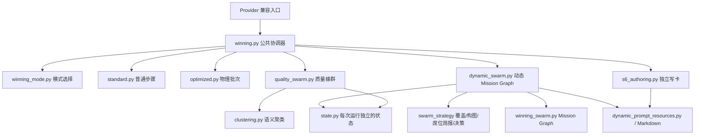

# Winning 执行流与模块边界

`winning` 是共同工作流入口，不是一种单独的执行配置。动态蜂群仍然存在：选择 `winning_swarm_dynamic_v2`、蜂群策略启用且不是定向恢复时，由动态 Mission Graph 执行 S1–S5，再交给独立 S6 写卡。

## 模式映射

| execution_profile_id | 初次执行 | 恢复/回溯 | 模块 |
| --- | --- | --- | --- |
| legacy_v1 | 普通 S 步骤依赖调度 | 仅运行选中的步骤 | `winning_flows/standard.py` |
| optimized_v2 | 首轮可把多个逻辑步骤合为一次物理调用，依赖满足后提交各逻辑结果 | 后续循环使用普通步骤调度 | `winning_flows/optimized.py` |
| swarm_quality_v1 | 广度探索与 S1/S2 并行 → 挑战 → 收敛 → 剩余 S 步骤 | 跳过蜂群探索，仅运行选中的步骤 | `winning_flows/quality_swarm.py` |
| winning_swarm_dynamic_v2 | 异质首波（S1/S2 互补种子 + 独特 S3/S4 侦察席 + 2–3 个跨池 S5）→ Coverage/Gap Analyzer 按覆盖缺口补招 → 跨池 S5 比较完整候选池、同维度择优后最多 7 项 → S6 每卡先写决策 spine，再并行写五栏，失败栏目按根因定向修复 | 跳过 Mission Graph；S6 恢复仍保留动态输入、spine 上下文和写卡合同 | `orchestration/swarm_strategy/`、`winning_flows/dynamic_swarm.py`、`s6_authoring.py` |

`orchestration/winning_mode.py` 统一解释配置。`initial_flow()` 同时考虑策略开关与恢复状态，避免恢复时重新触发蜂群。

`EQUIPMENT_DR_USE_DYNAMIC_WINNING_SCHEDULER` 仅控制普通 S 步骤使用“依赖就绪即启动”还是固定波次，它不会启用动态蜂群。`orchestration/dynamic_winning_scheduler.py` 是另一个已有的可复用调度组件；本次迁移保留原工作流实际使用的调度语义，没有因名称相似而切换到它。

## 依赖方向

聚类通过协调器注入的回调使用，图中表示逻辑依赖。模块不反向导入 `winning.py`，也不使用 `globals().update()`、`exec()` 或星号导入模拟闭包。Provider I/O、事件发布、输入、累积结果、控制器和跨模块回调均作为显式参数传入。

- `winning.py`：兼容入口、公共步骤合同与输入投影、模式分发、公共回溯与最终交付。它不再包含动态 Mission Graph、质量蜂群任务执行器或并行写卡的实现。
- `orchestration/swarm_strategy/`：纯策略层，无 Provider/账本/提示词依赖。`coverage.py` 从 Query 和候选字段做覆盖矩阵，`briefs.py` 给每个 S3/S4 席位分配独占覆盖轴，`composition.py` 按 `target_instances` 组异质首波，`decisions.py` 给出 EXPAND/VERIFY/REVIEW/STOP。多人协作时策略变更应落在此包，而不是改执行循环。
- `winning_swarm.py`：把策略计划变成 Mission Graph，并提供跨池 S5 重连和受治理补招入口。
- `dynamic_swarm.py`：动态实例执行、独立创作、候选账本、组合评审；不负责构图策略，也不负责 S6 成稿。
- `quality_swarm.py`：私有 specialist 执行器及广度/挑战/收敛三阶段；不调用动态 Mission Graph。
- `s6_authoring.py`：动态路径先并行跨卡生成紧凑 spine，再按卡并行生成五个独立栏目；仅对失败栏目或质量根因做有界修复。每栏接收职责边界和 spine 只读上下文，由调用方传入动态/普通写卡合同。
- `state.py`：每次运行单独创建 `SwarmState`，保存候选、任务和动态交接结果，避免跨任务共享状态。
- `helpers.py`：候选、交接与画像辅助逻辑。原 `winning.py` 的已有 helper 导入保留为显式兼容导出。

仍然共享的基础函数通过明确的具名导入来自 `coordinator.py`、`s6_quality.py` 和领域模块；本次没有改造 Provider 协议或整个报告系统。公共合同、质量门与最终交付仍在共同协调层，不能将此理解为整个项目已完全解耦。

### 策略、运行时端口与取消语义

`orchestration/swarm_strategy/` 是无 Provider I/O 的纯策略边界。`coverage.py` 将 Query 与候选结构化字段映射为覆盖轴、重复度、反制覆盖和边际新颖度；`decisions.py` 以纯函数返回 `EXPAND`、`VERIFY`、`REVIEW` 或 `STOP`。动态执行器读取宿主实际的 swarm 调用、可用 token 和时间预算，并为 pending S5/S6 调用预留最低调用余量；首个 S5 reviewer 启动后，coverage recruitment cutoff 永久生效。

`winning_flows/ports.py` 当前提供结构性 `Protocol`：`ModelRuntime`、`SwarmRuntime`、`CardRuntime` 和 `BudgetRuntime`。这些 Protocol 约束执行模块需要的最小能力，但尚不代表整个 provider/coordinator 已完成统一端口化。

取消语义按执行模式区分：普通 `standard.py` 流水线在一个步骤失败后取消并等待兄弟任务；动态 Mission Graph 的等待 heartbeat 只是进度事件，不因观测间隔超时取消仍运行的模型任务。宿主关闭时由 runtime 取消 discovery futures；`_ignore_runtime_deadline` 只放宽 wall-clock 截止，模型调用默认仍计入声明的预算。

## 动态提示词

资源目录：`src/equipment_deep_research/agents/prompts/dynamic_winning/`。

S1/S2 的真实种子提示词与 S5 的独立评分提示词已接通 Markdown。动态首波不再克隆六个同质创作者：`target_instances`（默认 10，下限 8）从异质 archetype 池中选出互补 S1/S2、独特 S3/S4 侦察席和 2–3 个跨池 S5。每个创作席位在调用时收到 Query 派生的 `coverage_steer`：一个独占覆盖轴、互补焦点值和已占用族群，迫使模型离开 Query 最显然的拦截弹解。Coverage/Gap Analyzer 在至少两个创作者发布后即可并行补招，不必等首波全部结束；S5 启动后停止补招。跨池 S5 比较完整候选池并读取覆盖矩阵，先同维度择优，再按五项综合分跨维度择优，最多保留 7 项。S6 对入选装备先形成 compact spine，再并行撰写五栏；栏目首稿内静默检查字数、独占信息、完整因果和技术落装，只有结构/语义根因才进入有界修复。S3/S4 默认只跑一轮创作。

Markdown 用 `<!-- prompt: section -->` / `<!-- /prompt -->` 划定正文。标题不发送给模型，正文空白保持原样。文件按进程缓存，修改后需要重启 worker。资源路径基于模块文件位置，与启动工作目录无关。

## 验证

`tests/equipment_deep_research/unit/test_winning_execution_flows.py` 覆盖配置/恢复分流、流水线就绪与异常取消、优化批次的逻辑结果提交、运行状态隔离、动态提示词合同，以及真实 Mission Graph 通过模拟 Provider 调用边界读取 S1–S5 Markdown。

原有 Provider、蜂群、命名与导入测试继续运行。验证不访问真实模型，不生成真实研究结果。
